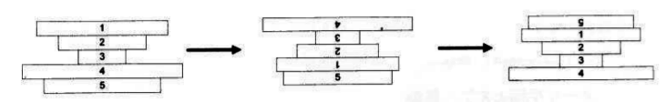

Quicksort
===========
Be careful about the boundary

    #include <stdio.h>
    #include <stddef.h>
    void swap(int* arr, int i, int j){
        if(i!=j) {
            int tmp = arr[i];
            arr[i] = arr[j];
            arr[j] = tmp;
        }
    }
    
    void helper(int* arr, int start, int end) {
        if(start >=end) {
            return;
        }
        int pivot = arr[start];//Use the first value as pivot
        int i = start;
        int j = end;
        //partition
        while(i<j) {
            swap(arr,i,j);
            while(arr[i] < pivot ) i++; //left smaller
            while(arr[j] >= pivot) j--; //right greater
    
        }
        helper(arr, start, j);
        helper(arr, i, end);
    }
    
    void m_qsort(int* arr, int len) {
        helper(arr,0, len-1);
    }
    
    int main() {
        int arr[] = {34, 14, 98, 2, 72, 39};
        m_qsort(arr, 5);
        int i;
        for(i = 0; i< 6; i++) {
            printf(&quot;%d &quot;, arr[i]);
        }
        printf(&quot;\n&quot;);
    }

Prefix Sorting(Sorting pancake)
==============================
Note: 1.3 of the beauty of coding.

Given an arbitrary array, each time revert the prefix, of the array, how
to optimize the process of revert. Here is an example, through 3 revert,
the 4th pancake goes to the bottom:

#Analysis 1
A very naive method to do this is we recursively put the greatest to the
bottom. It needs 2 steps to turn the largest pancake to the bottom.

1. Revert from the top to the largest. So that the largest will be at the
   top.
2. Revert from the top to the bottom. Now the largest will from top to
   bottom.

Then we can recursively do the above step for the top n-1, n-2 pancakes.
So this method takes 2(n-1) steps to revert.  (We don't need to do
anything for the last pancake.)

So the intuitive way is to use 2(n-1) as an upper bound, to traverse all
possible reversion.

    class CPrefixSorting {
    public:
        CPrefixSorting() {
            m_nCakeCnt = 0;
            m_nMaxSwap = 0;
        }

        void Run(int* pCakeArray, int nCakeCnt) {
            Init(pCakeArray, nCakeCnt);

            m_nSearch = 0
            Search(0);
        }

        void Output() {
            for(int i = 0; i < m_nMaxSwap; i++) {
                printf("%d ", m_arrSwap[i]);
            }
        }
    private:
        void Init(int* pCakeArray, int nCakeCnt) {
            m_nCakeCnt = n;

            m_CakeArray = new int[m_nCakeCnt];
            for (int i = 0; i < m_nCakeCnt; i++) {
                m_CakeArray[i] = pCakeArray[i];
            }

            m_nMaxSwap = nCakeCnt*2;

            m_SwapArray = new int[m_nMaxSwap];
            
            m_ReverseCakeArray = new int[m_nCakeCnt];
            for(i = 0; i < m_nCakeCnt; i++) {
                m_ReverseCakeArray[i] = m_CakeArray[i];
            }
            m_ReverseCakeArraySwap = new int[m_nMaxSwap];
        }

        int LowerBound(int* pCakeArray, int nCakeCnt) {
            int t, ret = 0;
            //Compare the neighbor
            for(int i = 1; i < nCakeCnt; i++) {
                t = pCakeArray[i] - pCakeArray[i-1];
                if((t==1)||(t==-1)) {
                } else{
                    ret++;
                }
            }
        }

        void Search(int step) {
            int i, nEstimate;
            m_nSearch++;
            nEstimate j= LowerBound(m_ReverseCakeArray, m_nCakeCnt);
            //A* search?
            if(step+nEstimate > m_nMaxSwap) {
                return;
            }
            if(IsSorted(m_ReverseCakeArray, m_nCakeCnt)) {
                if(step < m_nMaxSwap) {
                    m_arrSwap[i] = m_ReverseCakeArraySwap[i];
                }
                return;
            }
            //Recursively revert
            for(i = 1; i<m_nCakeCnt; i++) {
                Revert(0, i);
                m_ReverseCakeArraySwap[step] = i;

                //Recursive search
                Search(step+1);
                Revert(0,i); //revert back

            }
        }
        void Revert(int nBegin, int nEnd) {
            int i , j, t;
            for(i = nBegin, j = nEnd; i<j; i++, j--) {
                t = m_ReverseCakeArray[i];
                m_ReverseCakeArray[i] = m_ReverseCakeArray[j];
                m_ReverseCakeArray[j] = t;
            }
        }
        private:
        int* m_CakeArray;
        int m_nCakeCnt;
        int m_nMaxSwap;
        int* m_SwapArray;
    }

