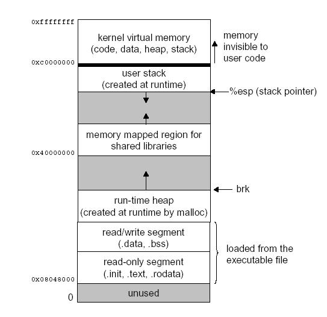

# Intermediate Memory Topics
## How a Computer Views Memory
Normally numeric data is operated on a word at a time. Instructions are
also stored in memory. Each instruction is a different length. Most
instructions take up one or two storage locations for the instruction
itself, and then storage locations for the instruction's arguments. For
example:
    
```asm
movl data_items (, %edi, 4), %ebx
```

Takes up to 7 storage locations. 

* The first two hold the instruction
* the third one tells which registers to use
* the next four hold the storage location of `data_items`

Some terms:

* **Word**: the size of a normal register. On X86, a word is four bytes. Most
  computer operations handle a word at a time.
* **Address**: number that refer to a **byte** in memory.
  Normally we don't type numeric address of anything, but we let the
  assembler do it for us. *When we use labels in code, the symbol used in
  the label will be equivalent to the address it is labelling*. The
  assembler will then *replace that symbol with its address wherever you
  use it in your program*.


## Memory Layout of a Linux Program
When your program is loaded into memory:

* `.section` is loaded into its own region of memory.
* The actual instructions (`.text` section) are loaded at the address
  `0x08048000`
* The `.data` section is loaded immediately after `.text`, followed by the
  `.bss` section.


The last byte that can be addressed on Linux is location `0xbfffffff`.
Linux starts the stack here, the initial layout of the stack is as
follows:

* At the bottom of the stack (lowest), there is a word of memory that is
  zero.
* After that comes the null-terminated name of the program using ASCII
  characters.
* After the program name comes the program's environment variables
* Then come the program's command-line arguments.
* After these, we have the number of arguments that were used. Then the
  program begins, this is where the sack pointer `%esp` is pointing.

The layout of a linux program is represented as follows:



Pushes on stack move `%esp` down in memory. For example:
```asm
pushl %eax
```

is equivalent to:
```asm
movl %eax, (%esp) # put value to currently pointed to
subl $4, %esp     # move down
```

Your program's data region starts at the bottom of memory and goes up. The
stack starts at the top of the memory and moves downward with each push.
This middle part between the stack and your program's data section is
inaccessible memory. 

The last accessible memory address to your program is called the *system
break*

The memory layout of Linux Program at startup:

    0xbfffffff
    | ------------------------ |
    | Environment Variables    |
    | ------------------------ |
    | ...                      |
    | ------------------------ |
    | Arg #2                   |
    | ------------------------ |
    | Arg #1                   |
    | ------------------------ |
    | Program name             |
    | ------------------------ |
    | # of args                | <- %esp
    | ------------------------ |
    | Unmapped Memory          |
    | ------------------------ | <- Break
    | Program Code and Data    |
    | ------------------------ |
    0x08048000

## Virtual Memory
Before loading your program, Linux finds an empty physical memory space
large enough to fit your program, and then tells the processor to pretend
that this memory is actually at the address `0x0804800` to load your
program into.

*mapping*: assigning virtual addresses to physical address.

Overview of the way memory accesses are handled under linux:

* The program tries to load memory from a virtual address.
* The processor, using tables supplies by Linux, transforms the virtual
  memory address into a physical memory address on the fly.
* If the processor does not have a physical address listed for the memory
  address, it sends a request to Linux to load it.
* Linux looks at the address. If it is mapped to a disk location, it
  continues on to the next step. Otherwise, it terminates the program with
  a segmentation fault.
* If there is not enough room to load the memory from disk, Linux will
  move another part of the program or another program onto disk to make
  room.
* Linux then moves data into a free physical memory address. 
* Linux updates the processor's virtual-to-physical memory mapping tables
  to reflect the changes.
* Linux restores control to the program, causing it to re-issue the
  instruction which caused this process to happen.

Memory is separated out into groups called *pages*. All of the memory
mappings are done a page at a time. 

Note that when a page in memory needed to swap out, it uses the Hard disk
as the backup.

## Getting More Memory
Linux has a facility to move the break point to accommodate an
application's memory needs.

If you need more memory, you just tell Linux where you want the new break
point to be, and Linux will map all the memory you need between the
current and new break point, and then move the break point to the spot you
specify.

The way tell Linux to move the break point is through `brk` system call.
The `brk` system call is call number 45 (in `%eax`). `%ebx` should be
loaded with the requested breakpoint. Then you call `int $0x80` to signal
Linux to do its work. After mapping in your memory, Linux will return the
new break point in `%eax`.

## A simple Memory Manager

```asm
.section .data
# This pionts to the beginning of the memory we are managing
# Note that the heap start at from the .data section, just after the 
# .text
heap_begin:
.long 0

# This points to one location the memory we are managing
current_break:
.long 0

##### STRUCTURE INFORMATION ###
# size of space for memory region header
.equ HEADER_SIZE, 8
#Location of the "available" flag in the header
.equ HDR_AVAIL_OFFSET, 0
#Location of the size of field in the header
.equ HDR_SIZE_OFFSET, 4

### Constants ###
.equ UNAVAILABLE, 0
.equ AVAILABLE, 1
.equ SYS_BRK, 45
.equ LINUX_SYSTEMCALL, 0x80

.section .text

#### FUNCTIONS ###
##allocate_init##
# PURPOSE: call this function to initialize the
# functions (specifically, this sets heap_begin and
# current_break). This has no parameters and no
# return value.
.globl allocate_init
.type allocate_init,@function
allocate_init:
pushl %ebp               # standard function stuff, base pointer
movl %esp, %ebp

 # If the brk system call is called with 0 in %ebx, it
 # returns the last valid usable address
movl $SYS_BRK, %eax      # find out where the break is
movl $0, %ebx
int $LINUX_SYSCALL
incl %eax                # %eax now has the last valid
                         # address, and we want the
                         # memory location after that
movl %eax, current_break # store the current break

movl %eax, heap_begin    # store the current break as our
                         # first address. This will cause
                         # the allocate function to get
                         # more memory from Linux the
                         # first time it is run
movl %ebp, %esp          # exit the function
popl %ebp
ret
#### END OF FUNCTION

##allocate##
#PURPOSE: This function is used to grab a section of
# memory. It checks to see if there are any
# free blocks, and, if not, it asks Linux
# for a new one.
#
#PARAMETERS: This function has one parameter - the size
# of the memory block we want to allocate
#
#RETURN VALUE:
# This function returns the address of the
# allocated memory in %eax. If there is no
# memory available, it will return 0 in %eax
#
######PROCESSING########
#Variables used:
#
# %ecx - hold the size of the requested memory
# (first/only parameter)
# %eax - current memory region being examined
# %ebx - current break position
# %edx - size of current memory region
#
#We scan through each memory region starting with
#heap_begin. We look at the size of each one, and if
#it has been allocated. If it’s big enough for the
#requested size, and its available, it grabs that one.
#If it does not find a region large enough, it asks
#Linux for more memory. In that case, it moves
#current_break up

.globl allocate
.type allocate,@function
.equ ST_MEM_SIZE, 8                       # stack position of the memory size
                                          # to allocate
allocate:
pushl %ebp                                # standard function stuff
movl %esp, %ebp
movl ST_MEM_SIZE(%ebp), %ecx              # %ecx will hold the size
                                          # we are looking for (which is the first
                                          # and only parameter)

movl heap_begin, %eax                     # %eax will hold the current
                                          # search location

movl current_break, %ebx                  # %ebx will hold the current
                                          # break

alloc_loop_begin:                         # here we iterate through each
                                          # memory region

cmpl %ebx, %eax                           # need more memory if these are equal
je move_break

                          # grab the size of this memory
movl HDR_SIZE_OFFSET(%eax), %edx
                          # If the space is unavailable, go to the
cmpl $UNAVAILABLE, HDR_AVAIL_OFFSET(%eax)
je next_location                          # next one

cmpl %edx, %ecx                            # If the space is available, compare
jle allocate_here                          # the size to the needed size. If its
                                           # big enough, go to allocate_here
next_location:
addl $HEADER_SIZE, %eax                   # The total size of the memory
addl %edx, %eax                           # region is the sum of the size
                                          # requested (currently stored
                                          # in %edx), plus another 8 bytes
                                          # for the header (4 for the
                                          # AVAILABLE/UNAVAILABLE flag,
                                          # and 4 for the size of the
                                          # region). So, adding %edx and $8
                                          # to %eax will get the address
                                          # of the next memory region

jmp alloc_loop_begin                      # go look at the next location

allocate_here:                            # if we’ve made it here,
                                          # that means that the
                                          # region header of the region
                                          # to allocate is in %eax
                                          # mark space as unavailable
movl $UNAVAILABLE, HDR_AVAIL_OFFSET(%eax)
addl $HEADER_SIZE, %eax                   # move %eax past the header to
                                          # the usable memory (since
                                          # that’s what we return)
movl %ebp, %esp                           # return from the function
popl %ebp
ret


move_break:                                # if we’ve made it here, that
                                           # means that we have exhausted
                                           # all addressable memory, and
                                           # we need to ask for more.
                                           # endpoint of the data,
                                           # and %ecx holds its size

                                           # we need to increase %ebx to
                                           # where we _want_ memory
                                           # to end, so we
addl $HEADER_SIZE, %ebx                    # add space for the headers
                                           # structure

addl %ecx, %ebx                            # add space to the break for
                                           # the data requested
                                           # now its time to ask Linux
                                           # for more memory
pushl %eax                                 # save needed registers
pushl %ecx
pushl %ebx
movl $SYS_BRK, %eax                        # reset the break (%ebx has
                                           # the requested break point)
int $LINUX_SYSCALL
                                           # under normal conditions, this should
                                           # return the new break in %eax, which
                                           # will be either 0 if it fails, or
                                           # it will be equal to or larger than
                                           # we asked for. We don’t care
                                           # in this program where it actually
                                           # sets the break, so as long as %eax
                                           # isn’t 0, we don’t care what it is
cmpl $0, %eax                              # check for error conditions
je error
popl %ebx                                  # restore saved registers
popl %ecx
popl %eax
#set this memory as unavailable, since we’re about to
#give it away
movl $UNAVAILABLE, HDR_AVAIL_OFFSET(%eax)
#set the size of the memory
movl %ecx, HDR_SIZE_OFFSET(%eax)
#move %eax to the actual start of usable memory.
#%eax now holds the return value
addl $HEADER_SIZE, %eax
movl %ebx, current_break # save the new break
movl %ebp, %esp          # return the function
popl %ebp
ret
error:
movl $0, %eax            # on error, we return zero
movl %ebp, %esp
popl %ebp
ret
########END OF FUNCTION########
##deallocate##
#PURPOSE:
# The purpose of this function is to give back
# a region of memory to the pool after we’re done
# using it.
#
#PARAMETERS:
# The only parameter is the address of the memory
# we want to return to the memory pool.
#
#RETURN VALUE:
# There is no return value
#
#PROCESSING:
# If you remember, we actually hand the program the
# start of the memory that they can use, which is
# 8 storage locations after the actual start of the
# memory region. All we have to do is go back
# 8 locations and mark that memory as available,
# so that the allocate function knows it can use it.
.globl deallocate
.type deallocate,@function
#stack position of the memory region to free
.equ ST_MEMORY_SEG, 4
deallocate:
#since the function is so simple, we
#don’t need any of the fancy function stuff
#get the address of the memory to free
#(normally this is 8(%ebp), but since
#we didn’t push %ebp or move %esp to
#%ebp, we can just do 4(%esp)
movl ST_MEMORY_SEG(%esp), %eax
#get the pointer to the real beginning of the memory
subl $HEADER_SIZE, %eax
#mark it as available
movl $AVAILABLE, HDR_AVAIL_OFFSET(%eax)
#return
ret
########END OF FUNCTION##########
```
