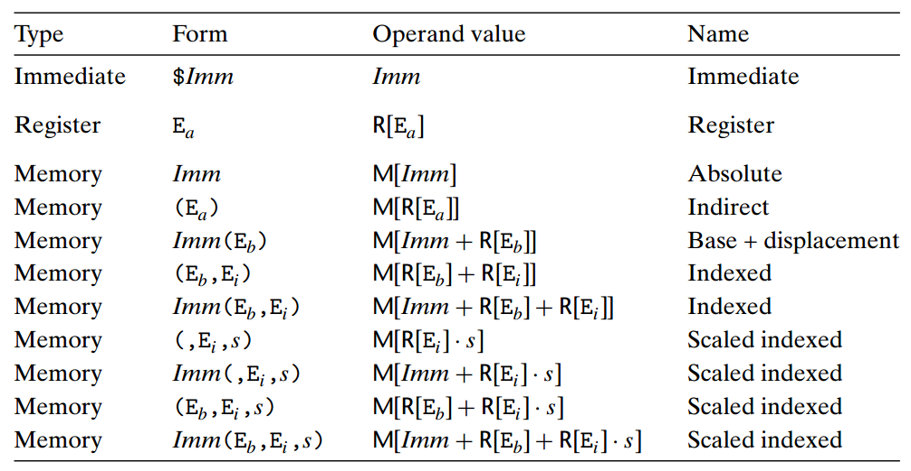

# Introduction

## Object code and linkers
Assemblers read your source code files and generate an object code file containing the machine instructions that the CPU understands, plus any data you've defined in the source code.

The object code files produced by modern assemblers are a sort of intermediate step between source code and executable program. This intermediate step is a type of binary file called an **object module**, or simply an object code file.

Object code files cannot themselves be run as programs. An additional step, called linking, is necessary to turn object code files into executable program files.

The reason for object code files as intermediate steps is that a single large source code file may be divided up into numerous smaller source code files to keep the files manageable in size and complexity. The assembler assembles the various fragments separately, and the several resulting object code files are then woven together into a single executable program file. 

Not so: the linker does more than just stitch lumps of object code together into a single piece. It ensures that function calls out of one object module arrive at the target object module, and that all the many memory references actually reference what they're supposed to reference. The assembler's job is obvious; the linker's job is subtle. Both are necessary to produce a finished, working executable file.

Each object module may contain the following:

* Program code, including named procedures
* References to named procedures lying outside the module
* Named data objects such as numbers and strings with predefined values
* Named data objects that are just empty space “set aside” for the program's use later
* References to data objects lying outside the module
* Debugging information
* Other, less common odds and ends that help the linker create the executable file

To process several object modules into a single executable:

1. build an index called a **symbol table**, with an entry for every named item in every object module the linker links, with information about what name (called a symbol) refers to what location within the module. 
* Once the symbol table is complete, the linker builds an image of how the executable program will be arranged in memory when the operating system loads it. This image is then written to disk as the executable file.

Object modules are allowed to refer to symbols in other object modules. During assembly, these external references are left as holes to be filled later. 

Debugging information is, in a sense, a step backward: portions of the source code, which was all stripped out early in the assembly process, are put back in the object module by the assembler. 

## The Assembly Language Development Process

1. Create your assembly language source code file in a text editor.
2. Use your assembler to create an object module from your source code file.
3. Use your linker to convert the object module (and any previously assembled object modules that are part of the project) into a single executable program file.
4. Test the program file by running it, using a debugger if necessary.
5. Go back to the text editor in step 1, fix any mistakes you may have made earlier, and write new code as necessary.
6. Repeat steps 1–5 until done.

## First Program
    #VARIABLES:
    # %eax holds the system call number
    # %ebx holds the return status
    #
    .section .data
    .section .text
    .globl _start
    _start:
    movl $1, %eax     # this is the linux kernel command
                      # number (system call) for exiting
                      # a program
    movl $0, %ebx     # this is the status number we will
                      # return to the operating system.
                      # Change this around and it will
                      # return different things to
                      # echo $?
    int $0x80         # this wakes up the kernel to run
                      # the exit command

Assembly: 
    
    as --32 exit.s -o exit.o

Link:
    
    ld -melf_i386 exit.o -o exit

## Outline
Anything starting with a period isn't directly translated into a machine
instruction. It's an instruction to the assembler itself -- *assemble
directives* or *pseudo-operations*. The `.section` command breaks your
program up into sections. 

* `.section .data`: list any memory storage you will need for data.
* `.section .text`: starts the text section. Where the program
  instructions live
* `.globl _start`: `_start` is a *symbol*, which means that it is going to
  replaced by something else either during assembly or linking. Symbols
  are generally used to mark locations of programs or data. So you can
  refer to them by name instead of by their location number.

  `.globl` means that the assembler shouldn't discard this symbol after
  assembly because the liner will need it. `_start` is a special symbol
  that always needs to be marked with `.globl` because it marks
  the location of the start of the program
* `_start:` *defines* the value of `_start` label. A label is a symbol
  followed by a colon.
* `movl $1, %eax`: transfer number `1` into the `%eax` register. Two
  operands *source* and *destination*. In this case *source* is literal
  number 1, and destination is `%eax` register.

Note: `addl`, `subl`, `imull` add/subtract/multiply the source
from/to/by the destination operand and save the result into the
destination.

Other instructions may have an operand hardcoded in. `idivl` requires
dividend be in `%eax` and `%edx` be zero, and the quotient is then
transferred to `%eax` and the remainder to `%edx`. Divisor can be any
register or memory location.

General-purpose registers:

* `%eax`
* `%ebx`
* `%ecx`
* `%edx`
* `%edi`
* `%esi`

Special-purpose registers:

* `%ebp`
* `%esp`
* `%eip`
* `%eflags`

Some of the registers, like `%eip` and `%eflags` can only be accessed
through special instructions. The others can be accessed using the same
instructions as general-purpose register, but they have special meanings,
special uses, or simply faster when used in a specific way.

The dollar sign `$` in front of `1` indicate that we want to use immediate
mode addressing. All access mode refer to the following figure:

The reason we are moving the number 1 to `%eax` is because we are
preparing to call the Linux Kernel. The number `1` is the number of `exit`
system call.

When you make a system call, the system call number has to be loaded into
`%eax`. Depending on the system call, other registers may have to have
values in them as well. The *parameters* are stored in other registers.
For the `exit` system call, the operating system requires a status code be
loaded in `%ebx`. So we load `%ebx` with `0` by:

    movl $0, %ebx

Linux simply requires that certain registers be loaded with certain
parameter values before making a system call. `%eax` is always required to
be loaded with the system call number. For the other registers, each
system call has different requirements.

The next instruction:
    
    int $0x80

The `int` stands for *interrupt*. The `0x80` is the interrupt number to
use. An *inerrupt* interrupts the normal program flow, and transfers
control from our program to Linux so that it will do the system call. 

## Planning the program
Find the max number. Let's name the address where the list of numbers
starts as `data_items`. Let's say that the last number in the list will be
a zero, so we know where to stop. Assign each of the register.

* `%edi` -- hold the current position of the list
* `%ebx` -- hold the current highest value in the list
* `%eax` -- hold the current element being examined.

To implement this program, we need flow control instructions. In this
program, this will be accomplished by two different instructions, the
conditional jump and unconditional jump.

* Conditional jump: changes paths based on the result of a previous
  comparison or calculation.
* The unconditional jump just goes directly to a different path no matter
  what.

Loop is implemented by doing unconditional jumps to the beginning of the
loop at the end of the loop. you have to always remember to have a
conditional jump to exit the loop somewhere.

Source code:

    # Finds the maximum number of a set of data items
    # %edi -- Index of the data being examined
    # %ebx -- largest data item found
    # %eax -- current data item

    .section .data

    data_items:
    .long 3, 67, 34, 222, 45, 75, 54, 34, 44, 33, 22, 11, 66, 0

    .section .text
    .globl _start

    _start:
    movl $0, %edi
    movl data_items(,%edi, 4), %eax # load the first byte of data, edi is 0
    movl %eax, %ebx  # since this is the first item, %eax is the largest

    start_loop:
    cmpl $0, %eax 
    je loop_exit
    incl %edi # load next value
    movl data_items(,%edi,4), %eax
    cmpl %ebx, %eax
    jle start_loop # one isn't bigger
    movl %eax, %ebx
    jmp start_loop

    loop_exit:
    # %ebx is the status code for the exit system call
    # and it already has the maximum number

    movl $1, %eax
    int $0x80

What it does:
    
    data_items:
    .long 3, 67, 34, 222, 45, 75, 54, 34, 44, 33, 22, 11, 66, 0

`data_item` is a label that refers to the location that follows it.
Then there is a directive that starts with `.long`. That causes assembler
to reserve memory for the list of numbers that follow it. `data_itmes`
refers to the location of the first one. Because `data_items` is a label,
any time in our program where we need to refer to this address we can use
the `data_items` symbol, and the assembler will substitute it with the
address where the numbers start during assembly.

Types:

* `.byte` one storage location for each number
* `.int` two storage location
* `.long` four storage locations
* `.ascii` enter in characters into memory, each take up one storage
  location

We use `%edi` as our *index*, and we load it with 0.
    
    movl $0, %edi

We load the data in the index pointed by `%edi`:

    movl data_items(,%edi,4), %eax

The instruction in a general form of this:

    movl BEGINNINGADDRESS(,%INDEXREGISTER, WORDSIZE)

Let's now see the loop. We have these instructions:

    cmpl $0, %eax
    je end_loop

The `cmpl` instruction compares the two values. This compare instruction
store the result in the `%eflags` register (status register).

The next line is a flow control instruction which says to *jump* to the
`end_loop` location if the values that were just compared are equal.

* `je` jump if equal
* `jg` jump is second value was greater than the first
* `jge` second value was greater than or equal to the first.
* `jl` jump if second value was less than the first value.
* `jle` jump if the second value was less than or equal to the first
  value.
* `jmp` jump no matter what

Then

    incl %edi
    movl data_items(,%edi,4), %eax

`incl` increments the value of `%edi` by one. And `%eax` is getting the
next value from the list.

Now:

    cmpl %ebx, %eax
    jle start_loop

Here we compare our current value, stored in `%eax` to the biggest so far,
in `%ebx`. If the current value is less than or equal to biggest, we don't
care about it, so we jump back to the beginning of the loop.

Otherwise, we record the larger value:
    movl %eax, %ebx
    jmp start_loop
