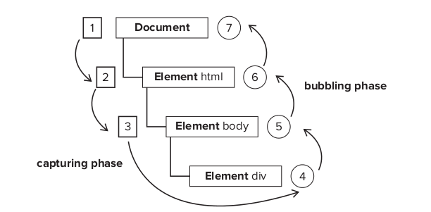

# Events
## Event Flow
When you click on a button, you're clicking not just on the button but
also on its container and on the page as a whole.

*Event flow* describes the order in which events are received on the page.


## Event Bubbling

Consider the page:

```html
<!DOCTYPE html>
<html>
<head>
    <title>Event Bubbling Example</title>
</head>

<body>
    <div id="my-div">Click Me</div>
</body>
</html>
```

When you click the `<div>` element, the `click` occurs in the following
order:

1. `<div>`
* `<body>`
* `<html>`
* `document`

The `click` event is first fired on `<div>`, then goes up the `DOM` tree.
Firing on each node along its way until it reaches the `document` object.

## Event Capturing
The theory of event capturing is that the least specific node should
receive the event first and the most specific node should receive the
event last.

Event capturing was really designed to intercept the event before it
reached the intended target. 

So the `click` event of the above example should be as follow:


1. `document`
* `<html>`
* `<body>`
* `<div>`

All of the modern browsers actually begin event capturing at the
`window`-level.

### DOM Event Flow
Two phases:

* The event capturing phase
* The event bubbling phase.

1. event capturing occurs first, providing opportunity to intercept events
   if necessary.
* The actual target receives the event
* Bubbling, allows a final response to the event

As shown in the following figure:



* In DOM event, the actual target (`<div>`) does not receive the event
during the capturing phase. 
    - So the capturing moves from `document` to `<html>` to `<body>` and
      stops
* The next phase is "at target", which fires on the `<div>` and is
  considered to be part of bubbling phase.
* Then the bubbling phase occurs and the event travels back up to the
  `doucment`.

Note: Even though the DOM Level 2 Events specification indicates that the
capturing phase doesn’t hit the event target, Internet Explorer 9, Safari,
Chrome, Firefox, and Opera 9.5 and later all fire an event during the
capturing phase on the event target. The end result is that there are two
opportunities to work with the event on the target.

## Event Handlers
Events are certain actions performed either by user or by the browser
itself.

These events have names like `click`, `load` and `mousemove`.

A function that is called in response is called *event handler* (or *event
listerner*).

### HTML Event Handlers
Event of elements can be assigned using HTML.

```html
<input type="button" value="Click Me" onclick="alert('Clicked')" />
```

Or contain in a script:

```html
<script type="text/javascript">
function showMsg() {
    alert("Hello World");
}
</script>
<input type="button" value="Click Me" onclick="showMsg()" />
```

### DOM Level 0 Event Handler
Assign a function to an event handler property.

To assign, you must first retrive a reference to the obj. 

```javascript
var btn = document.getElementById("myBtn");
btn.onclick = function() {
    alert('Clicked');
};
```

Note that the event handler is considered to a method of the element,
meaning that `this` is equivalent to element:

```javascript
var btn = document.getElementById("myBtn");
btn.onclick = function() {
    alert(this.id); //"myBtn"
};
```

### DOM Level 2 Event Handlers
Two functions:

* `addEventListener()`
* `removeEventListener()`

These methods **exists on all DOM nodes**, and accept three arguments:

* the event name to handle
* The event handler function
* A boolean value indicating whether to call the event handelr during the
  capture (`true`) or during the bubble phase (`false`)

```javascript
var btn = document.getElementById(“myBtn”);
btn.addEventListener(“click”, function(){
    alert(this.id);
}, false);
btn.addEventListener(“click”, function(){
    alert(“Hello world!”);
}, false);
```

Note that multiple event handlers can be added.

Event handler added via `addEventListener()` can be removed only by using
`removeEventListener()` with the same arguments as adding. This means that
anonymous function added cannot be removed

```javascript
var btn = document.getElementById(“myBtn”);
btn.addEventListener(“click”, function(){
    alert(this.id);
}, false);
//other code here
btn.removeEventListener(“click”, function(){ // won't work!!!
    alert(this.id);
}, false);
```

The following is a working example:

```javascript
var btn = document.getElementById(“myBtn”);
var handler = function(){
    alert(this.id);
};
btn.addEventListener(“click”, handler, false);
//other code here
btn.removeEventListener(“click”, handler, false); //works!
```

## The Event Obj
When an event related to the DOM is fired, all the relevant information is
gathered and stored in an object called `event`

### The Event Obj
The `event` obj is passed in as the sole argument to an event handler.

```javascript
var btn = document.getElementById("myBtn");
btn.onclick = function(event) {
    alert(evetn.type); //"click"
};
btn.addEventListener("click", function(event) {
    alert(event.type); //"click"
}, false);
```

Inside an event handler, the `this` is always the value of
`currentTarget`, where as `target` contains only actual target of the
event.

```javascript
document.body.onclick = function(event){
    alert(event.currentTarget === document.body); //true
    alert(this === document.body); //true
    alert(event.target === document.getElementById(“myBtn”)); //true
};
```

Single function to handle multiple events:

```javascript
var btn = document.getElementById(“myBtn”);
var handler = function(event){
    switch(event.type){
        case “click”:
            alert(“Clicked”);
            break;
        case “mouseover”:
            event.target.style.backgroundColor = “red”;
            break;
        case “mouseout”:
            event.target.style.backgroundColor = “”;
            break;
    }
};
btn.onclick = handler;
btn.onmouseover = handler;
btn.onmouseout = handler;
```

The `preventDefault()` is used to prevent the default action of a
particular event. The default of link, for example is to navigate to the
URL, if you want to prevent that, we can do:

```javascript
var link = document.getElementById("myLink");
link.onclick = function(event) {
    event.preventDefault();
};
```

The `stopPropagation()` method stops the flow of an event through the DOM
structure immediately.

Example, prevent an event handler on `document.body` from being fired:

```javascript
var btn = document.getElementById("myBtn");
btn.onclick = function(event) {
    alert("clicked!");
    event.stopPropagation();
};
document.body.onclick = function(event) {
    alert("body clicked");
};
```

Without `stopPropagation()`, two alerts would be displayed. However, the
`click` event never reaches `doucment.body`.

Note that this is stopped at bubbling phase.

The `eventPhase`:

* Capture phase -- 1
* At the target -- 2
* bubble phase -- 3

```javascript
var btn = document.getElementById(“myBtn”);
btn.onclick = function(event){
    alert(event.eventPhase); //2
};
document.body.addEventListener(“click”, function(event){
    alert(event.eventPhase); //1
}, true);
document.body.onclick = function(event){
    alert(event.eventPhase); //3
};
```

## CustomEvent

```javascript
// add an appropriate event listener
obj.addEventListener("cat", function(e) {process(e.detail)});

//create and dispatch an event
var event = new CustomEvent("cat", {"detail": {"haha":true}});
obj.dispatchEvent(event);
```
