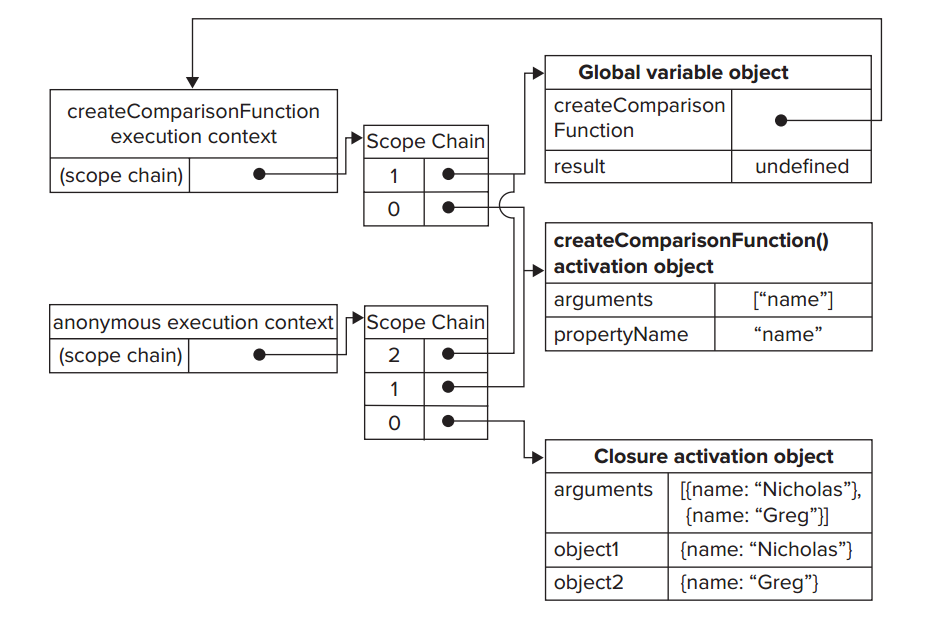

# Function Expressions
## Anonymous Function
Function declaration

```javascript
function functionName(arg0, arg1, arg2) {
//function body
}
```

Anonymous function:

```javascript
var functionName = function(arg0, arg1, arg2){
//function body
};
```

Key of function declaration, *function declaration boisting*

```javascript
sayHi();
function sayHi(){
    alert(“Hi!”);
}
```

The following doesn't work.

```javascript
sayHi(); //error – function doesn’t exist yet
var sayHi = function(){
    alert(“Hi!”);
};
```

## Recursion

```javascript
function factorial(num){
    if (num <= 1){
        return 1;
    } else {
        return num * arguments.callee(num-1);
    }
}
```

Note that `arguments.callee` is not accessible to script running in strict
mode. Instead you can use **named function expression**

```javascript
var factorial = (function f(num){
    if (num <= 1){
        return 1;
    } else {
        return num * f(num-1);
    }
});
```

## Closures
Closures are functions that have access to variables from another
function’s scope.

When a function is called, an execution context is created, and its scope
chain is created. The activation object for the function is initialized
with values for `arguments` and any named arguments. The outer function’s
activation object is the second object in the scope chain. This process
continues for all containing functions until the scope chain terminates
with the global execution context. 

Example:

```javascript
function createComparisonFunction(propertyName) {
    return function(object1, object2){
        var value1 = object1[propertyName];
        var value2 = object2[propertyName];
        if (value1 < value2){
            return -1;
        } else if (value1 > value2){
            return 1;
        } else {
            return 0;
        }
    };
}

//create function
var compareNames = createComparisonFunction(“name”);
//call function
var result = compareNames({ name: “Nicholas” }, { name: “Greg”});
//dereference function - memory can now be reclaimed
compareNames = null;
```

The activation object from `createComparision()` cannot be destroyed onece
the function finishes the execution, because a reference is still exists
in the anonymous function's scope chain. 

The scope-chain relation



### Closure and Variables
There is one notable side effect of this scope-chain configuration. The
closure always gets the last value of any variable from the containing
function. Remember that the closure stores a reference to the entire
variable object, not just to a particular variable

Example:

```javascript
function createFunctions() {
    var result = new Array();

    for(var i = 0; i < 10; i++) {
        result[i] = function() {
            return i;
        }
    }

    return result;
}
```

This function returns an array of functions. It seems that each function
should just return the value of its index. In reality, every function
returns 10. Since each function has the `createFunctions()` activation
object in its scope chain, they all referring to the same `i`.

Force the closure to act appropriately:

```javascript
function createFunctions() {
    var result = new Array();

    for(var i = 0; i< 10; i++) {
        result[i] = function(num) {
            return function() {
                return num;
            };
        }(i);
    }
    return result;

}
```

Instead of assigning a closure directly into the array, an anonymous
function is defined and called immediately.

The anonymous function has one argument, `num`, which is the number that
the result function should return.

The variable `i` is passed in as an argument to the anonymous function.
Since **function arguments are passed by value**, the current value of `i`
is **copied** into the argument `num`.

### The this Object

The `this` is bound **at runtime** based on the context in which a function is
executed: when used inside global functions, `this` is equal to `window`
in nonstrict mode and `undefined` in strict mode.

`this` is equal to the object when called as an object method.

Anonymous functions are not bound to an object in this context, meaning
`this` object points to `window`.

Example:

```javascript
var name = “The Window”;
var object = {
    name : “My Object”,
    getNameFunc : function(){
        return function(){
            return this.name;
        };
    }
};
alert(object.getNameFunc()()); //”The Window” (in non-strict mode)
```

Each function automatically two special variables as soon as the function
is called: `this` and `arguments`. **An inner function can never access
these variables directly from an outer function**.

It is possible to allow a closure access to a different `this` object by
storing in another variable that the closure can access:

```javascript
var name = "The Window"

var object = {
    name: "My Object",
    getNameFunc: function() {
        var that = this;
        return function() {
            return that.name;
        };
    }
};
alert(object.getNameFunc()()); // "My Object"
```

Before defining the anonymous function, a variable named `that` is
assigned equal to the `this` object. 

When the closure is defined, it has access to `that`, since it is a
uniquely named variable in the containing function. Even after the
function is returned, `that` is still bound to `object`, so calling
`object.getNameFunc()()` returns `My Object`.

---

Special Cases:

```javascript
var name = "The Window";
var object = {
    name: "My Object",
    getName: function() {
        return this.name;
    }
};
```

Various ways to call `object.getName()` and the results:

```javascript
object.getName(); //”My Object”
(object.getName)(); //”My Object”
(object.getName = object.getName)(); //”The Window” in non-strict mode
```

The third line performs an assignment and then calls the result. Because
of this assignment expression is the function itself, the `this` value is
not maintained, so `"The Window"` is returned.

#### As a method
A method is a function that's attached to an object

```javascript
var foo = {};
foo.someMethod = function() {
    alert(this);
}
```

When invoked as a method, `this` will be bound to the object the
function/method is part of.

#### As A Function
If you have a stand alone function, the `this` variable will be bound to
the `global` object, almost always the `window` object

```javascript
var foo = function() {
    alert(this);
}
```
Many people consider this as a bad design. Since a **callback is invoked
as a function and not as a method**, this is why you are seeing what
appears to be inconsistent behavior. 

Get around the problem by:

```javascript
var foo = {};
foo.someMethod = function() {
    var that = this;
    function bar() {
        alert(that);
    }
}
```

#### As a Constructor
You can also invoke a function as a constructor. 

```javascript
function Foo() {
    this.confusing = 'hell yeah';
}

var myObject = new Foo();
```

When invoked as a constructor, a new Object will be created, and `this`
will be bound to that object. 

#### With the Apply Method
Finally, every function has a method. Apply lets you determine what the
value of `this` will be, and also lets you pass in an array of arguments:

```javascript
function foo(a, b) {
    alert(a);
    alert(b);
    alert(this);
}

var args = ['ah', 'be'];
foo.apply('omg', args);
```


### Memory Leaks
Storing a scope in which an HTML element is stored effectively ensures
that the element cannot be destroyed.

```javascript
function assignHandler() {
    var element = document.getElementById("someElement");
    element.onClick = function() {
        alert(element.id);
    };
}
```
* The anonymous function keeps references to `assignHandler()`'s activation
  object.
* As long as the anonymous function exists, the reference count for
  `element` will be at least 1, which means the **memory will never be
  reclaimed**.

Note that the element has an reference to the anonymous function in its
value `onClick`, and the function has an reference to the element,
therefore, it's a circular reference.


Remedied by changing the code slightly:

```javascript
function assignHandler() {
    var element = document.getElementById("someElement");
    var id = element.id;

    element.onclick = function() {
        alert(id);
    };

    element = null;
}
```

This version of the code, a copy of `element`'s ID is stored in a variable
that is used in the closure, eliminating the circular reference.

Remember: the closure has a reference to the containing function's entire
activation object, which contains `element`. So it is necessary to set the
`element` variable equal to `null`.

One more example:

```javascript
var circular;

circular = function(arg) {
  if (arg) {
    alert(arg);
  }
  else {
    // refers to the |circular| variable, and by that to itself.
    circular("No argument");
  }
}

circular("hello");
circular();
```

The function saved in `circular` refers to the `circular` variable, and
thereby itself. It implicitly hods a reference itself, creating a circular
reference.

Even if `circular` now goes out of scope, it is still referenced from the
functions scope. 

### Mimicking Block Scope
The basic syntax of an anonymous function used as a block scope (often
called a *private scope*) is as follows:

```javascript
(function() {
    //block code here
})();
```

This function defineds an anonymous function that is called immediately
and is also called an *immediately invoked function*.

## Private Variables
Strictly speaking, Javascript has no concept of private. There is,
however, a concept of *private variable*. Any variable defined inside a
function is considered private since it is inaccessible outside that
function. 

A *privileged method* is a public method that has access to private
variables and/or private functions. Here are two ways to create privileged
methods on objects:

The first is to do inside a constructor

```javasript
function MyObject() {
    //private variables and functions
    var privateVariable = 10;
    function privateFunction() {
        return false;
    }

    //privileged methods
    this.publicMethod = function() {
        privateVariable++;
        return privateFunction();
    };
}
```

This works because the privileged methods become closures with full access
to all variables and functions defined inside the constructor's scope.

Once an instance of `MyObject` is created, there is no way to access
`privateVariable` and `privateFunction()` directly; you can do so only by
way of `publicMehtod()`.

### Static Private Variables
Privileged methods can also be created by using a private scope to define
the private variables or functions.

```javascript
(function(){
    //private variables and functions
    var privateVariable = 10;
    function privateFunction(){
        return false;
    }
    //constructor, MyObject is global
    MyObject = function(){
    };

    //public and privileged methods
    MyObject.prototype.publicMethod = function(){
        privateVariable++;
        return privateFunction();
    };
})();
```

In this pattern, a private scope is created to enclose the constructor and
its methods.

Note that this pattern defines the constructor by using a **function
expression**. Function declarations always create local functions, which
is undesired in this case. For the same reason, the `var` keyword is not
used.

The main difference between this pattern and the previous one is that private variables and 
functions are shared among instances. Since the privileged method is
defined on the prototype.

Consider:

```javascript
(function(){
    var name = “”;
        Person = function(value){ 
        name = value; 
    };
    Person.prototype.getName = function(){
        return name;
    };
    Person.prototype.setName = function (value){
        name = value;
    };
})();
var person1 = new Person(“Nicholas”);
alert(person1.getName()); //”Nicholas”
person1.setName(“Greg”);
alert(person1.getName()); //”Greg”
var person2 = new Person(“Michael”);
alert(person1.getName()); //”Michael”
alert(person2.getName()); //”Michael”
```

### The Module Pattern
The previous patterns create private variables and privileged methods for custom types. The module 
pattern does the same for singletons. Singletons are objects of 
which there will only ever be one instance. Traditionally, singletons are created in JavaScript using 
object literal notation.

The module pattern augments the basic singleton to allow for private
variables and privileged methods:

```javascript
var singleton = function () {
    //private variables and functions
    var privateVariable = 10;

    function privateFunction() {
        return false;
    }
    //privileged/public methods and properties
    return {
        publicProperty: true,
        publicMethod: function () {
            privateVariable++;
            return privateFunction();
        }
    };
}();

```

### The Module-Augmentation Pattern
Another take on the module pattern calls for hte augmentation of the
object before returning it. Useful when object needs to be an instance of
a particular type but must be augmented with additional properties and/or
methods:

```javascript
var application = function () {
    //private variables and functions
    var components = new Array();
    //initialization
    components.push(new BaseComponent());
    //create a local copy of application
    var app = new BaseComponent();
    //public interface
    app.getComponentCount = function () {
        return components.length;
    };
    app.registerComponent = function (component) {
        if (typeof component == “object”) {
            components.push(component);
        }
    };
    //return it
    return app;
}();
```
The creation of a variable named `app` that is a new instance of
`BaseComponent`.
