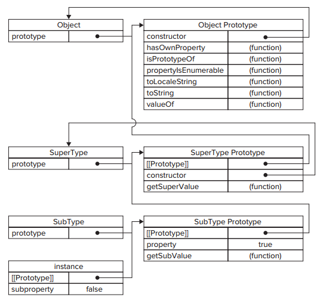

# Inheritance

## Prototype Chaining
*prototype chaining* is the primary method of inheritance in ECMAScript.
The basic idea is to use the concept of prototypes to inherit properties and methods between two 
reference types

Relationships:

* constructor has a prototype object that points back to the constructor
* Instances have an internal pointer to the prototype


What if the **prototype were actually an instance of another type**.

That would mean the prototype itself would have a pointer to a different
prototype that, in turn, would have a pointer to another construcotr.

And the pattern can continue, and this is the basic idea behind prototype
chaining.

Implementing prototype chaining involves the following code pattern:

```javascript
function SuperType(){
    this.property = true;
}

SuperType.prototype.getSuperValue = function(){
    return this.property;
};

function SubType(){
    this.subproperty = false;
}

//inherit from SuperType
SubType.prototype = new SuperType();
// add new prototype, it's value of the SuperType instance
SubType.prototype.getSubValue = function (){
    return this.subproperty;
};
var instance = new SubType();
alert(instance.getSuperValue()); //true
```
This overwrites the original prototype and replaces it with a new object
After the inheritance takes place, a method is assigned to
`SubType.prototype`, adding a new method on top of what was inherited from
`SuperType`. 

Instead of using the default prototype of `SubType`, a new prototype is
assigned. That new prototype happens to be an instance of `SuperType`, so it
not only gets the properties and methods of a `SuperType` instance but also
points back to the `SuperType`’s prototype. 

Note, a call to `instance.getSuperValue()` results in a three-step search:

1. the instance
* `SubType.prototype`
* `SuerType.prototype` (through the instance bounded with `SuperType.prototype`)

The search for properties and methods always continues until the end of
the prototype chain is reached.

### Default Prototypes
In reality, there is another step in the prototype chain. All reference
types inherit from `Object` by default.

The default prototype for any function is an instance of `Object`, meaning
that its internal prototype pointer points to `Object.prototype`.

This is how custom types inherit all of the default methods such as
`toString()` and `valueOf()`

Complete prototype chain:



### Prototype and Instance Relationships
Note, when the subtype is created:

1. It generate an internal pointer `[[Prototype]]` points to the `prototype`
   property of `SubType`
* The `SubType`'s `prototype` property itself is an instance of `SuperType`, so it has it's own
  internal `[[Prototype]]` pointing to `prototype` of `SuperType`. (Note
  all the `prototype` properties are instances themselves, so has
  `[[Prototype]]` as well. This is how the chain work)
* The `constructor` is a property of the auto-created `prototype`, the 

Note that instances don't have `prototype` property, they only have
`[[Prototype]]` pointer!!.


Use the `instanceof` operator, which returns `true` whenever an instance
is used with a constructor that appears in its prototype chain.

```javascript
alert(instance instanceof Object); //true
alert(instance instanceof SuperType); //true
alert(instance instanceof SubType); //true
```

Or use `isPrototypeOf()` method:

```javascript
alert(Object.prototype.isPrototypeOf(instance)); //true
alert(SuperType.prototype.isPrototypeOf(instance)); //true
alert(SubType.prototype.isPrototypeOf(instance)); //true
```

### Working with Methods
Often a subtype will need to either override a supertype method or introduce new methods that 
don’t exist on the supertype. To accomplish this, the methods must be added to the prototype after 
the prototype has been assigned

```javascript
function SuperType() {
    this.property = true;
}
SuperType.prototype.getSuperValue = function () {
    return this.property;
};

function SubType() {
    this.subproperty = false;
}
//inherit from SuperType
SubType.prototype = new SuperType();
//new method
SubType.prototype.getSubValue = function () {
    return this.subproperty;
};
//override existing method
SubType.prototype.getSuperValue = function () {
    return false;
};
var instance = new SubType();
alert(instance.getSuperValue()); //false
```

Note: object literal approach to creating prototype methods cannot be used
with prototype chaining, because you end up overwriting the chain.

### Problems with Prototype Chaining
Even though prototype chaining is a powerful tool for inheritance, it is
not without its issues. The major issue revolves around prototypes that
contain reference values. Recall from earlier that prototype properties
containing reference values are shared with all instances; this is why
properties are typically defined within the constructor instead of on the
prototype. When implementing inheritance using prototypes, the prototype
actually becomes an instance of another type, meaning that what once were
instance properties are now prototype properties

## Constructor Stealing
Basic idea: call the supertype constructor from within the subtype
constructor

Example:

```javascript
function SuperType() {
    this.colors = [“red”, “blue”, “green”];
}

function SubType() {
    //inherit from SuperType
    SuperType.call(this);
}
var instance1 = new SubType();
instance1.colors.push(“black”);
alert(instance1.colors); //”red,blue,green,black”
var instance2 = new SubType();
alert(instance2.colors); //”red,blue,green”
```

### Problem with Constructor Stealing

Methods must be defined inside the constructor, so there's no function
reuse.

## Combination Inheritance
Sometimes called pseudo classical inheritance combines prototype chaining
and constructor stealing to get the best.

Example:

```javascript
function SuperType(name) {
    this.name = name;
    this.colors = [“red”, “blue”, “green”];
}
SuperType.prototype.sayName = function () {
    alert(this.name);
};

function SubType(name, age) {
    //inherit properties
    SuperType.call(this, name);
    this.age = age;
}
//inherit methods
SubType.prototype = new SuperType();
SubType.prototype.sayAge = function () {
    alert(this.age);
};
var instance1 = new SubType(“Nicholas”, 29);
instance1.colors.push(“black”);
alert(instance1.colors); //”red,blue,green,black”
instance1.sayName(); //”Nicholas”;
instance1.sayAge(); //29
var instance2 = new SubType(“Greg”, 27);
alert(instance2.colors); //”red,blue,green”
instance2.sayName(); //”Greg”;
instance2.sayAge(); //27
```

Combination inheritance also preserve the behavior of `instanceof` and
`isPrototypeOf()`.

## Prototypal Inheritance
Prototypes allow you to create new object based on existing object without
the need for defining custom types:

```js
function object(o) {
    function F() {}
    F.prototype = o;
    return new F();
}
```

The `object()` function creates a temporary constructor, assigns a given
object as the constructor's prototype, and returns a new instance of the
temporary type.

Essentially, `object()` performs a **shadow copy** of any object that is
passed to it.

Example:

```javascript
var person = {
    name: “Nicholas”,
    friends: [“Shelby”, “Court”, “Van”]
};
var anotherPerson = object(person);
anotherPerson.name = “Greg”;
anotherPerson.friends.push(“Rob”);
var yetAnotherPerson = object(person);
yetAnotherPerson.name = “Linda”;
yetAnotherPerson.friends.push(“Barbie”);
alert(person.friends); //”Shelby,Court,Van,Rob,Barbie”
```

You have an object that you want to use as the base of another object.

## Parasitic Inheritance

```javascript
function createAnother(original){
    var clone = object(original); //create a new object by calling a function
    clone.sayHi = function(){ //augment the object in some way
        alert(“hi”);
    };
    return clone; //return the object
}
```

## Parasitic Combination Inheritance
The most inefficient part of Combination inheritance is that the suertype
constructor is always called twice.

Parasitic combination inheritance uses constructor stealing to inherit
properties but uses a hybrid form of prototype chaining to inherit
methods. The basic idea is this: instead of calling the supertype
constructor to assign the subtype’s prototype, all you need is a copy of
the supertype’s prototype. Essentially, use parasitic inheritance to
inherit from the supertype’s prototype and then assign the result to the
subtype’s prototype. The basic pattern for parasitic combination
inheritance is as follows:

```javascript
function inheritPrototype(subType, superType){
    var prototype = object(superType.prototype); //create object
    prototype.constructor = subType; //augment object
    subType.prototype = prototype; //assign object
}
```
