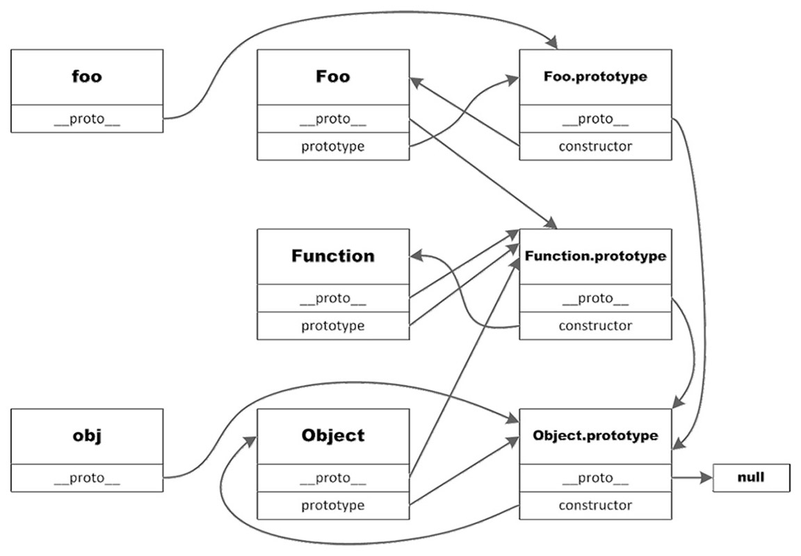

# Object Oriented Programming
## Higher level understanding
Note that JavaScript **DOES NOT** have class, it only has Object, as it's
a prototype language.

### Create and Access
Several ways to create object

```javascript
var foo = {};
foo.prop_1 = 'bar';
foo.prop_2 = false;
foo.prop_3 = function() {
    return 'hello world';
}
console.log(foo.prop_3);
```


Second way to create members:

```javascript
var foo = {};
foo['prop1'] = 'bar';
foo['prop2'] = false;
foo['prop3'] = function() {
    return 'hello world';
}
```

More commonly:

```javascript
var foo = {
    'prop1': 'bar',
    prop2: false,
    prop3: function () {
        return 'hello world';
    }
};
```
Note that the quotes are optional.

### Constructor

```javascript
function User(name, uri) {
    this.name = name;
    this.uri = uri;
    this.display = function() {
        console.log(this.name);
    }
}

var someuser = new User('byvoid, 'www.byvoid.com');
```

### Context Object
The context is the `this` pointer.

Example:
```javascript
var someuser = {
    name: 'byvoid',
    display: function() {
        console.log(this.name);
    }
};

someuser.display(); // output byvoid

var foo = {
    bar: someuser.display,
    name: 'foobar'
};
foo.bar();// output foobar
```

Meaning that the `this` is tie to the current scope (object)!!

Another example:
```javascript
var someuser = {
    name: 'byvoid',
    func: function() {
        console.log(this.name);
    }
};

var foo = {
    name: 'foobar'
};

someuser.func(); // output byvoid

foo.func = someuser.func;
foo.func(); // output foobar

name = 'global';
func = someuser.func;
func(); // output global
```

### Bind
Bind can fix the context:

```javascript
var someuser = {
    name: 'byvoid',
    func: function() {
        console.log(this.name);
    }
};

var foo = {
    name: 'foobar'
};

foo.func = someuer.func;
foo.func(); // output foobar

foo.func1 = someuser.func.bind(someuser);
foo.func1(); // output byvoid

func = someuser.func.bind(foo);
func(); // output foobar

func2 = func;
func2(); // output foobar
```

Bind can also used to bind parameter:

```javascript
var person = {
    name: 'byvoid',
    says: function(act, obj) {
        console.log(this.name + ' ' + act + ' ' + obj);
    }
};

person.says('loves', 'diovyb'); // output byvoid loves diovyb
byvoidLoves = person.says.bind(person, 'loves');
byvoidLoves('you'); // output byvoid loves you.
```

It binds the context(`this` pointer) to `person`, and first parameter to
`'loves'`

#### Understanding Bind

```javascript

var someuser = {
    name: 'byvoid',
    func: function() {
        console.log(this.name);
    }
};

var foo = {
    name: 'foobar'
};

func = someuer.func.bind(foo)
func(); // output foobar

func2 = func.bind(someuser);
func2(); // output foobar
```
Why output foobar?

A simplified version of `bind` implementation:

```javascript
someuser.func.bind = function(self) {
    return this.call(self);
};
```

Then the above code expanded to:

```javascript
func = function() {
    return someuser.func.call(foo);
}

func2 = function() {
    return func.call(someuser);
}
```

As shown, `func` doesn't use `this` pointer at all. That's why the second
`bind` does nothing.

### Prototype
JavaScript doesn't have Class, Object is instantiated by Object.

Example:

```javascript
function Foo() {
    var innerVar = 'hello';
    this.prop1 = 'BYVoid';
    this.func1 = function() {
        innerVar = '';
    };
}

Foo.prototype.prop2 = 'Carbo';
Foo.prototype.func2 = function () {
    console.log(this.prop2);
};

var foo1 = new Foo();
var foo2 = new Foo();

console.log(foo1.func1 == foo1.func1); // false
console.log(foo1.func2 == foo2.func2); // true
```

So the function defined in `prototype` **won't construct again**.

### Prototype Chain
Three type of object:

* User created objects: created by `new`
* Constructor objects: functions used with `new`
* Prototype objects: pointed by `prototype`

The constructor object has `prototype` property, pointing to an prototype
object. When creating object using constructor, the `__proto__` property
of the created object will point to the `prototype` property of the
constructor.

Example:
```javascript
function Foo() {
}

Object.prototype.name = 'My Object';
Foo.prototype.name = 'Bar';
var obj = new Object();
var foo = new Foo();
console.log(obj.name); // 输出 My Objectc
console.log(foo.name); // 输出 Bar
console.log(foo.__proto__.name); // 输出 Bar
console.log(foo.__proto__.__proto__.name); // 输出 My Object
console.log(foo. __proto__.constructor.prototype.name); // 输出 Bar
```

As illustrated in the following figure:



### Deep Copy

```javascript
Object.prototype.clone = function () {
    var newObj = {};
    for (var i in this) {
        if (typeof (this[i]) == 'object' || typeof (this[i]) == 'function') {
            newObj[i] = this[i].clone();
        } else {
            newObj[i] = this[i];
        }
    }
    return newObj;
};
Array.prototype.clone = function () {
    var newArray = [];
    for (var i = 0; i < this.length; i++) {
        if (typeof (this[i]) == 'object' || typeof (this[i]) == 'function') {
            newArray[i] = this[i].clone();
        } else {
            newArray[i] = this[i];
        }
    }
    return newArray;
};
Function.prototype.clone = function () {
    var that = this;
    var newFunc = function () {
        return that.apply(this, arguments);
    };
    for (var i in this) {
        newFunc[i] = this[i];
    }
    return newFunc;
};
var obj = {
    name: 'byvoid',
    likes: ['node'],
    display: function () {
        console.log(this.name);
    },
};
var newObj = obj.clone();
newObj.likes.push('python');
console.log(obj.likes); // 输出 [ 'node' ]
console.log(newObj.likes); // 输出 [ 'node', 'python' ]
console.log(newObj.display == obj.display); // 输出 false
```

--- 

## Understanding Objects

### Types of properties:
Two types of properties: **data properties** and **accessor properties**.

#### Data Properties

Data properties contain a single location for a data value. Values are
read from and written to this location.

Four attributes:

* `[[Configurable]]` -- can or cannot be removed from the obj
* `[[Enumerable]]`
* `[[Writable]]`
* `[[Value]]`

When a property is explicitly added to an object, `[[Value]]` is set to
the assigned value and others are set to true.

Example:

```javascript
var person = {
    name: "Nicholas"
};
```

A **property** called `name` is created and `[[value]]` is set to `Nicholas` is

To change any of the default property, you must use
`object.defineProperty()` method. 

```javascript
var person = {};
Object.defineProperty(person, "name", {
    writable: false,
    value: "Nicholas"
});

console.log(person.name); //Nicholas
person.name = "Greg"; 
console.log(person.name); //Nicholas
```

#### Accessor Properties
Do not contain a data value, they contain a combination of a getter
function and a setting function.

* When an accessor property is read from, the getter function is called
  and it's the function's responsibility to return a valid value. 
* When an accessor property is written to, a function is called with a new
  value.

Accessor has four attributes:

* `[[Configurable]]`
* `[[Enumerable]]` 
* `[[Get]]`
* `[[Set]]`

It's not possible to define an accessor property, you must use
`Object.defineProperty()`:

```javascript
var book = {
    _year: 2004,
    edition: 1
};

Object.defineProperty(book, "year", {
    get: function() {
        return this._year;
    },
    set: function(newValue) {
        if (newValue > 2004) {
            this._year = newValue;
            this.edition += newValue - 2004;
        }
    }
});
book.year = 2005;
console.log(book.edition); //2
```

### Reading Property Attributes and Define multiple properties

Reading with `Object.getOwnPropertyDescriptor()` method.
```javascript
var book = {};
Object.defineProperties(book, {
    _year: {
        value: 2004
    },
    edition: {
        value: 1
    },
    year: {
        get: function () {
            return this._year;
        },
        set: function (newValue) {
            if (newValue > 2004) {
                this._year = newValue
                this.edition += newValue - 2004;
            }
        }
    }
});
var descriptor = Object.getOwnPropertyDescriptor(book, “_year”);
alert(descriptor.value); //2004
alert(descriptor.confi gurable); //false
alert(typeof descriptor.get); //”undefi ned”
var descriptor = Object.getOwnPropertyDescriptor(book, “year”);
alert(descriptor.value); //undefi ned
alert(descriptor.enumerable); //false
alert(typeof descriptor.get); //”function”
```

