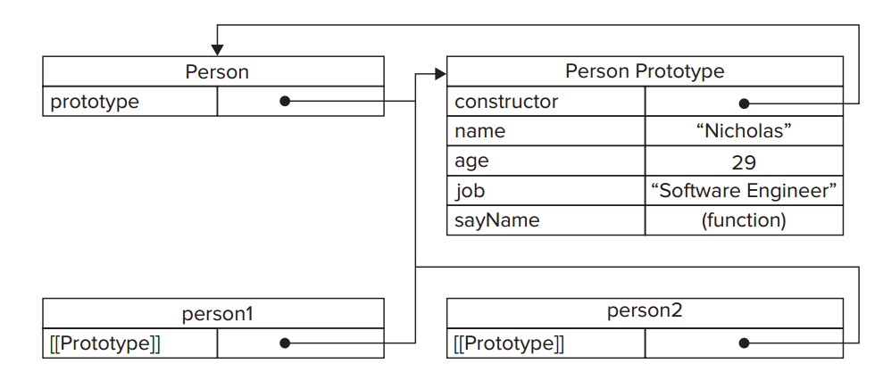

# Object Creation

## The Factory Pattern
Create function to encapsulate the creation of objects with specific
interfaces:

```javascript
function createPerson(name, age, job) {
    var o = new Object();
    o.name = name;
    o.age = age;
    o.job = job;
    o.sayName = function () {
        alert(this.name);
    };
    return o;
}
var person1 = createPerson(“Nicholas”, 29, “Software Engineer”);
var person2 = createPerson(“Greg”, 27, “Doctor”)
```

It does not address the issue of object identification (what type of
object an object is).

##The Constructor Pattern
There are native constructors, such as Object and Array, which are
available automatically in the execution environment at runtime. It is
also possible to define custom constructors that define properties and
methods for your own type of object. 

```javascript
function Person(name, age, job) {
    this.name = name;
    this.age = age;
    this.job = job;
    this.sayName = function () {
        alert(this.name);
    };
}
var person1 = new Person(“Nicholas”, 29, “Software Engineer”);
var person2 = new Person(“Greg”, 27, “Doctor”);
```

To create a new instance, use a `new` operator, essentially the following
steps taken:

1. create a new object
* assign `this` value of the constructor to the new object (the `this`
  point to the new object)
* Exec the code inside the operator
* return new object

### Constructors as Functions
The only difference between constructor functions and other functions is
**they way in which they are called**.

Constructors are after all, just functions; there's no special syntax to
define a constructor. Any function that is called with the `new` operator
acts as a constructor, whereas any function called without it acts just as
you would expect a normal function call.

```javascript
//use as a constructor
var person = new Person(“Nicholas”, 29, “Software Engineer”);
person.sayName(); //”Nicholas”

//call as a function
Person(“Greg”, 27, “Doctor”); //adds to window
window.sayName(); //”Greg”

//call in the scope of another object
var o = new Object();
Person.call(o, “Kristen”, 25, “Nurse”);
o.sayName(); //”Kristen”
```

### Problems with Constructors
Methods are created once for each instance.

So, in the previous example, both `person1` and `person2` have a method
called `sayName()`, but those methods are not the same instance of Function

A possible way to solve:

```javascript
function Person(name, age, job) {
    this.name = name;
    this.age = age;
    this.job = job;
    this.sayName = sayName;
}

function sayName() {
    alert(this.name);
}
var person1 = new Person(“Nicholas”, 29, “Software Engineer”);
var person2 = new Person(“Greg”, 27, “Doctor”);
```

But this breaks the encapsulation.

## The Prototype Pattern
Each function is created with a `prototype` property, which is an boject
containing **properties and methods that should be available to instances
of a particular refernce type**.

This object is literally a prototype for the object to be created onece
the constructor is called.

Benefit: all of its properties and methods are shared among object
instances. Instead of assigning object information in the constructor,
they can be assigned directly to the prototype:

```javascript
function Person() {}
Person.prototype.name = “Nicholas”;
Person.prototype.age = 29;
Person.prototype.job = “Software Engineer”;
Person.prototype.sayName = function () {
    alert(this.name);
};
var person1 = new Person();
person1.sayName(); //”Nicholas”
person2.sayName(); //"Nicholas"
alert(person1.sayName == person2.sayName); //true
```

The properties and `sayName()` are added directly to the `prototype`
property of `Person`.

### How Prototype Work
* Whenever a function is created, its `prorotype` is also created. (the
  default one)
* By default, all prototypes **automatically** get a property called
  `constructor` that points back to the function on which it is a
  property.
* Then, depending on the constructor, other properties and methods may be
  added to the prototype.
* When defining a custom constructor, the prototype gets the `constructor`
  property only default, all the other methods are inherited from
  `Object`.

When the constructor is called, the new instance has an internal pointer
to the constructor's prototype.

There is no standard way to access `[[Prototype]]` from script, but most
browsers support `__proto__`.

Example shown in the figure:



`isPrototypeOf()` method can be used determine if this relationship exists
between objects.

Note the differences between the `[[Prototype]]` and the `prototype`
property associate with `Function`.

The `[[Prototype]]` is an internal pointer to the `prototype` property of
the constructor in an **instance**.

---

Whenever a property is accessed for reading on an object:

1. The search begins on the object instance itself. If a property with
   given name is found, return.
* The search continue up the pointer to the prototype, if found on
  prototype, return.

---

Although it's possible read values in the prototype from object instance,
it's **not possible to overwrite them**.

If you add a property to an instance that has the same name as a property
on the prototype, you create the property on the instance.

```javascript
function Person(){
}
Person.prototype.name = “Nicholas”;
Person.prototype.age = 29;
Person.prototype.job = “Software Engineer”;
Person.prototype.sayName = function(){
    alert(this.name);
};

var person1 = new Person();
var person2 = new Person();

person1.name = “Greg”;
alert(person1.name); //”Greg” - from instance
alert(person2.name); //”Nicholas” - from prototype
```

Once a property is added to the object instance, it *shadows* any
properties of the same name on the prototype.

The `delete` operator will completely removes the instance property:

```javascript:
function Person(){
}
Person.prototype.name = “Nicholas”;
Person.prototype.age = 29;
Person.prototype.job = “Software Engineer”;
Person.prototype.sayName = function(){
    alert(this.name);
};
var person1 = new Person();
var person2 = new Person();
person1.name = “Greg”;

alert(person1.name); //”Greg” - from instance
alert(person2.name); //”Nicholas” - from prototype
delete person1.name;
alert(person1.name); //”Nicholas” - from the prototype
```

The `hasOwnProperty()` method determines if a property exists on the
instance or on the prototype. It returns `true` only if a property of the
given name exists on the **object instance**.

### Prototypes and the in Operator
The `in` operator returns `true` when a property is **accessible**.
(instance or prototype).

When using `for-in` loop, all properties that are accessible and can be
enumerated will be returned, including instance and prototype:

```javascript
var o = {
    toString : function(){
        return “My Object”;
    }
};
for (var prop in o){
    if (prop == “toString”){
        alert(“Found toString”); //won’t display in Internet Explorer
    }
}
```

To retrieve a list of all enumerable instance properties on an object,
you can use `Object.keys()` method

```javascript
var keys = Object.keys(Person.prototype);
alert(keys); //”name,age,job,sayName”
var p1 = new Person();
p1.name = “Rob”;
p1.age = 31;
var p1keys = Object.keys(p1);
alert(p1keys); //”name,age”
```

An alternate prototype syntax, by overwriting the prototype with an object
literal that contains everything:

```javascript
Person.prototype = {
    name : “Nicholas”,
    age : 29,
    job : “Software Engineer”,
    sayName : function () {
        alert(this.name);
    }
};
```

 Essentially, this syntax overwrites the default prototype
object completely, meaning that the `constructor` property is equal to that of a completely 
new object (the `Object` constructor) instead of the function itself. Although the instanceof
operator still works reliably, you cannot rely on the constructorto indicate the type of object, as 
this example shows:

```javascript
var friend = new Person();
alert(friend instanceof Object); //true
alert(friend instanceof Person); //true
alert(friend.constructor == Person); //false
alert(friend.constructor == Object); //true
```

You can set it specifically back:

```javascript
Person.prototype = {
    constructor: Person,
    name : “Nicholas”,
    age : 29,
    job : “Software Engineer”,
    sayName : function () {
        alert(this.name);
    }
};
```

However, the native `constructor` properties are not enumerable by
default, so you may use:

```javascript
//ECMAScript 5 only – restore the constructor
Object.defi neProperty(Person.prototype, “constructor”, {
    enumerable: false,
    value: Person
});
```

### Dynamic Nature of Prototypes
Since the process of looking up values on a prototype is search, changes
made to the prototype at any point are immediately reflected on instances,
even the instances that existed before the change was made.

```javascript
var friend= new Person();
Person.prototype.sayHi = function(){
    alert(“hi”);
};
friend.sayHi(); //”hi” - works!
```

Even though the `friend` instance was created prior to this change, it
still has access to the new method.

This happens because of the loose link between the instance and the
prototype.

* when `friend.sayHi()` is called, the instance is first searched for a
  property named `sayHi()`, not found.
* It continues to the prototype, since the link between the instance and
  the instance and the property is simply a pointer, not a copy, the
  search finds the new `sayHi` property on the prototype.

Although properties and methods may be added to the prototype at any time, and they are reflected 
instantly by all object instances, you cannot overwrite the entire prototype and expect the same behavior. 

The `[[Prototype]]` pointer is assigned when the constructor is called,
so changing the prototype to a different object destroys the tie between
the constructor and the original prototype.

Remember: the instance has a pointer to only the prototype, not to the
constructor.

```javascript
function Person(){
}
var friend = new Person();
    Person.prototype = {
    constructor: Person,
    name : “Nicholas”,
    age : 29,
    job : “Software Engineer”,
    sayName : function () {
        alert(this.name);
    }
};
friend.sayName(); //error
```

### Problems with Prototype
1. It negates the ability to pass initialization arguments into the
   constructor, meaning that all instances get the same values by defualt.
* All properties on the prototype are shared among instances, which is
  ideal for function. The real proplem occurs when a property contains a
  reference value.


## Combine the Constructor and Pattern

```javascript
function Person(name, age, job){
    this.name = name;
    this.age = age;
    this.job = job;
    this.friends = [“Shelby”, “Court”];
}
Person.prototype = {
    constructor: Person,
    sayName : function () {
        alert(this.name);
    }
};
var person1 = new Person(“Nicholas”, 29, “Software Engineer”);
var person2 = new Person(“Greg”, 27, “Doctor”);
person1.friends.push(“Van”);
alert(person1.friends); //”Shelby,Court,Van”
alert(person2.friends); //”Shelby,Court”
alert(person1.friends === person2.friends); //false
alert(person1.sayName === person2.sayName); //true
```

The hybrid constructor/prototype pattern is most widely used.

## Dynamic Prototype Pattern
The visual separation between the constructor and the prototype is
confusing. The dynamic prototype pattern seeks to solve this problem by
encapsulating all of the information within the constructor while
maintaining the benefits of using both a constructor and a prototype by
initializing the prototype inside the constructor, but only if it is
needed. 

You can determine if the prototype needs to be initialized by
checking for the existence of a method that should be available.

Example:

```javascript
function Person(name, age, job) {
    //properties
    this.name = name;
    this.age = age;
    this.job = job;
    //methods
    if (typeof this.sayName != “ function”) {
        Person.prototype.sayName = function () {
            alert(this.name);
        };
    }
}
var friend = new Person(“Nicholas”, 29, “Software Engineer”);
friend.sayName();
```

It adds the `sayName()` method if it doesn't already exist. This block of
code is executed only the first time the constructor is called.

## Parasitic Constructor
It is typically a fallback when the other patterns fail.

The basic idea of this pattern is to create a constructor that simply
wraps the creation and return of another object while looking like a
typical constructor. 

```javascript
function Person(name, age, job){
    var o = new Object();
    o.name = name;
    o.age = age;
    o.job = job;
    o.sayName = function(){
        alert(this.name);
    }; 
    return o;
}
var friend = new Person(“Nicholas”, 29, “Software Engineer”);
friend.sayName(); //”Nicholas”
```

When a constructor doesn't return a value, it return the new object
instance by default. Adding a `return` statement at the end of a
constructor allows you to override the value that is returned when the
constructor is called.

This allows you to create constructors for objecets that may not be
possible otherwise:

```javascript
function SpecialArray(){ 
    //create the array
    var values = new Array();
    //add the values
    values.push.apply(values, arguments);
    //assign the method
    values.toPipedString = function(){
        return this.join(“|”);
    };
    //return it
    return values; 
}
var colors = new SpecialArray(“red”, “blue”, “green”);
alert(colors.toPipedString()); //”red|blue|green”
```

## Durable Constructor
durable objects in JavaScript refers to objects that have no public
properties and whose methods don't reference the this object. 

Durable objects are best used in secure environment (forbid use of `this`
and `new`)

```javascript
function Person(name, age, job){
    //create the object to return
    var o = new Object();
    //optional: define private variables/functions here
    //attach methods
    o.sayName = function(){
        alert(name);
    }; 
    //return the object
    return o;
}
```

Note that instance methods on the created object don't refer to `this`.
There is no way to access the value of `name` from the returned object.
