# The creation and execution of process 1
## Creation of process 1
Linux use `fork` to create new threads.

    // init/main.c
    ....
    static inline _syscall0(int,fork) // corresponding to fork()
    static inline _syscall0(int,pause)
    static inline _syscall1(int,setup,void *,BIOS)
    ...
    void main(void) {
        ...
        sti();                           // setup interruption  (re-enable)
        move_to_user_mode();             // from privilege level 0 to 3
        if (!fork()) {        /* we count on this going ok */
            init();
        }
    /*
     *   NOTE!!   For any other task 'pause()' would mean we have to get a
     * signal to awaken, but task0 is the sole exception (see 'schedule()')
     * as task 0 gets activated at every idle moment (when no other tasks
     * can run). For task0 'pause()' just means we go check if some other
     * task can run, and if not we return here.
     */
        for(;;) pause();
    }

From the declaration of `fork()` above, calling `fork` is actually
execute the macro function `syscall0` in `unistd.h`
    
    //include/unistd.h
    #define __NR_setup	0	/* used only by init, to get system going */
    #define __NR_exit	1
    #define __NR_fork	2
    #define __NR_read	3
    #define __NR_write	4
    #define __NR_open	5
    #define __NR_close	6
    ...
    #define _syscall0(type,name) \
      type name(void) \
    { \
    long __res; \
    __asm__ volatile ("int $0x80" \
        : "=a" (__res) \
        : "0" (__NR_##name)); \
    if (__res >= 0) \
        return (type) __res; \
    errno = -__res; \
    return -1; \
    }
        ...

    ...
    void _exit(int status);
    //volatile void _exit(int status);
    int fcntl(int fildes, int cmd, ...);
    static int fork(void);
    int getpid(void);
    int getuid(void);
    int geteuid(void);
    ...

    // include/linux/sys.h
    extern int sys_setup();
    extern int sys_exit();
    extern int sys_fork(); // corresponding to _sys_fork in system_call.s
    extern int sys_read();
    extern int sys_write();
    extern int sys_open();

Note that the line `_syscall0(int, fork)` will be expanded to:

    int fork(void) { 
        long __res; 
    // int 0x80 is the entrance of system call
        __asm__ volatile ("int $0x80"
            : "=a" (__res)  // output part, _res value assigned to eax
            : "0" (2));     // input part, assign __NR_fork to eax
        if (__res >= 0)     // interruption return
            return (int) __res; 
        errno = -__res; 
        return -1; 
    }

The path of system call:
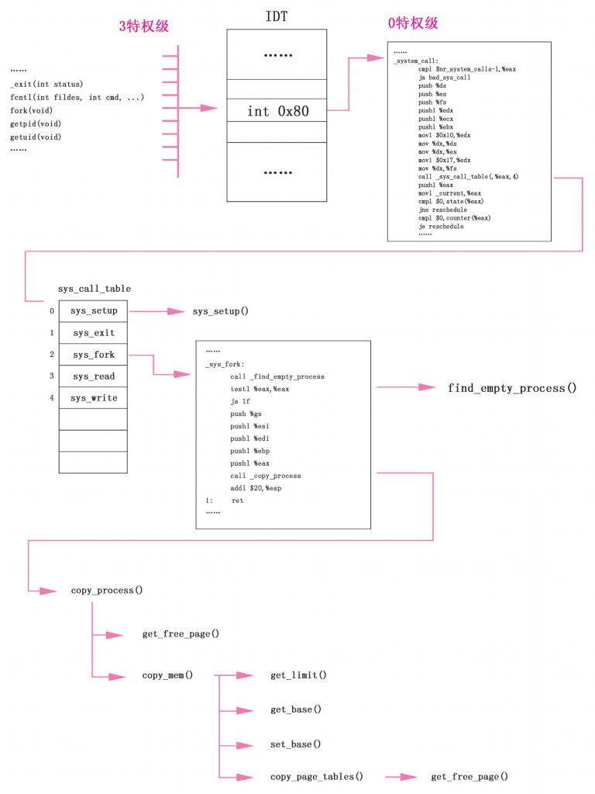

Execution:

1. `:"0" (__NR_fork)`, assign `__NR_fork`, the number of `fork` in
   `sys_call_table[]`, to `eax`. This is the offset number of `sys_fork()`
   in `sys_call_table`.
* `int $0x80`, generate a soft-interrupt. Interrupt will cause CPU to push
  registers `ss`, `esp`, `eflags`, `cs`, `eip` into `init_task`'s kernel
  stack. `move_to_user_mode` mentioned previously was to mimic the pushing
  of hardware. Those data will be used later to initialize `TSS` of
  process 1.

        // kernel/system_call.s
        system_call:
            cmpl $nr_system_calls-1,%eax  # int 0x80 -- entrance of system call
            ja bad_sys_call
            push %ds                      # The next 6 push are parameters for copy_
            push %es
            push %fs
            pushl %edx
            pushl %ecx                    # push %ebx,%ecx,%edx as parameters
            pushl %ebx                    # to the system call
            movl $0x10,%edx               # set up ds,es to kernel space
            mov %dx,%ds
            mov %dx,%es
            movl $0x17,%edx               # fs points to local data space
            mov %dx,%fs
            call *sys_call_table(,%eax,4) # call (_sys_call_table + 2x4, _sys_fork
            pushl %eax
            movl current,%eax
            cmpl $0,state(%eax)           # state
            jne reschedule
            cmpl $0,counter(%eax)         # counter
            je reschedule
        ret_from_sys_call:
            movl current,%eax             # task[0] cannot have signals
            cmpl task,%eax
            je 3f
            cmpw $0x0f,CS(%esp)           # was old code segment supervisor ?
            jne 3f
            cmpw $0x17,OLDSS(%esp)        # was stack segment = 0x17 ?
            jne 3f
            movl signal(%eax),%ebx
            movl blocked(%eax),%ecx
            notl %ecx
            andl %ebx,%ecx
            bsfl %ecx,%ecx
            je 3f
            btrl %ecx,%ebx
            movl %ebx,signal(%eax)
            incl %ecx
            pushl %ecx
            call do_signal
            popl %eax
        3:	popl %eax
            popl %ebx
            popl %ecx
            popl %edx
            pop %fs
            pop %es
            pop %ds
            iret

    Note the line `call _sys_call_table (,%eax, 4)`, `eax` has been assigned
    2, so this line is `call _sys_call_table + 2x4` (every entry in
    `_sys_call_table` is 4bits). So it's equivalent to `call
    _sys_call_table[2]`

        ...
        _sys_call:
        ...
        _sys_fork:

        sys_fork:
            call find_empty_process
            testl %eax,%eax # if the returned value is -EAGAIN(11), there have
                            # been 64 processes running 
            js 1f
            push %gs        # next 5 pushes for copy_process's parameters
            pushl %esi
            pushl %edi
            pushl %ebp
            pushl %eax      # the returned value 
            call copy_process
            addl $20,%esp
        1:	ret
        ...

### Find an unoccupied Process Number
Start executing `sys_fork()`. In `sched_init()` we've cleared the items in
`task[64]` except the 0th entry. Now we need to call
`find_empty_process()` to assign process 1 a new pid and `taks[64]` entry.

    // kernel/fork.c:

    int find_empty_process(void) //find a vacant position for new process
    {
        int i;

        repeat:
            if ((++last_pid)<0) last_pid=1;                           // if overflowed, assign 1
            for(i=0 ; i<NR_TASKS ; i++)                               // NR_TASKS is 64
                if (task[i] && task[i]->pid == last_pid) goto repeat;
        for(i=1 ; i<NR_TASKS ; i++)                                   // find the first empty i
            if (!task[i])
                return i;
        return -EAGAIN;                                               // EAGAIN is 11
    }

The last value that pushed to the stack is the task number `nr` returned
by `find_empty_process`. This is also the first parameter for
`copy_process`.

Now we are ready to execute `copy_process()`. Note that all the parameters
are related to previous pushing. 

    // kernel/fork.c
    int copy_process(int nr,long ebp,long edi,long esi,long gs,long none,
            long ebx,long ecx,long edx,
            long fs,long es,long ds,
            long eip,long cs,long eflags,long esp,long ss) {
        //the parameters are pushed by int 0x80 system_call, and sys_fork
        struct task_struct *p;
        int i;
        struct file *f;

        // get most significant page, use this page as task_union
        p = (struct task_struct *) get_free_page();
        if (!p)
            return -EAGAIN;
        task[nr] = p;
        ...
    }

Then call `get_free_page()` to request for a free page in main memory.
`get_free_page` will request empty space from the end of the main memory. 

Note task union is defined as 
    union task_union {
        struct task_struct task;
        char stack[PAGE_SIZE];
    }

As shown in the following figure:
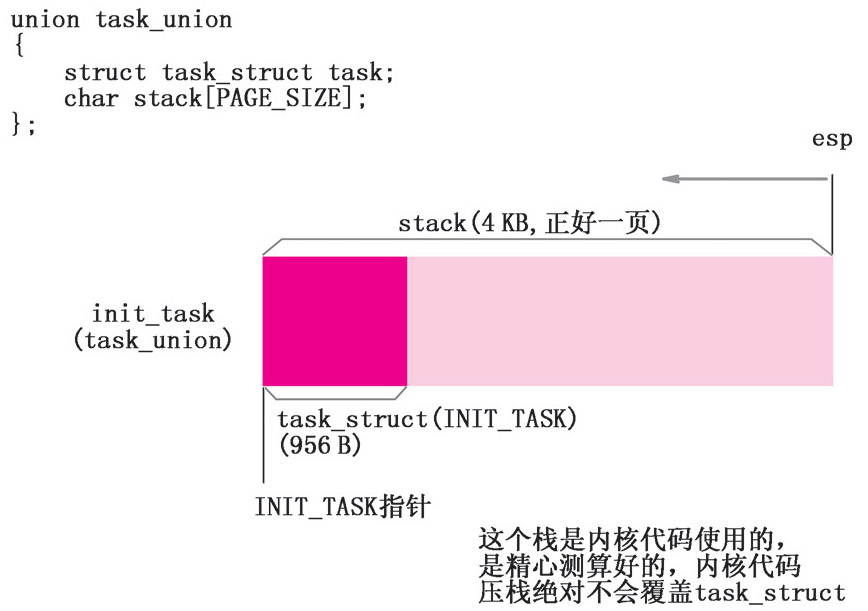
The front of the `task_union` is `task_struct` and lower end is
kernel stack. And they are added up to exactly one page. 

    int copy_process(int nr,long ebp,long edi,long esi,long gs,long none,
            long ebx,long ecx,long edx,
            long fs,long es,long ds,
            long eip,long cs,long eflags,long esp,long ss) {
        ...
        // NOTE!: the following statement now work with gcc 4.3.2 now, and you
        // must compile _THIS_ memcpy without no -O of gcc.#ifndef GCC4_3
        // current point to task_struct of current process. Now child and
        // parent processes have exactly the same task struct
        // current: pointer to current process, p pointer to the new process
        *p = *current;    /* NOTE! this doesn't copy the supervisor stack */
                          /* This only copied the task_struct, the kernel
                           * stack haven't been copied */

        p->state = TASK_UNINTERRUPTIBLE; //only wake up when it is set to ready state
        p->pid = last_pid; // customized for child process
        p->father = current->pid;
        p->counter = p->priority;
        p->signal = 0;
        p->alarm = 0;
        p->leader = 0;        /* process leadership doesn't inherit */
        p->utime = p->stime = 0;
        p->cutime = p->cstime = 0;
        p->start_time = jiffies;
        ...
    }

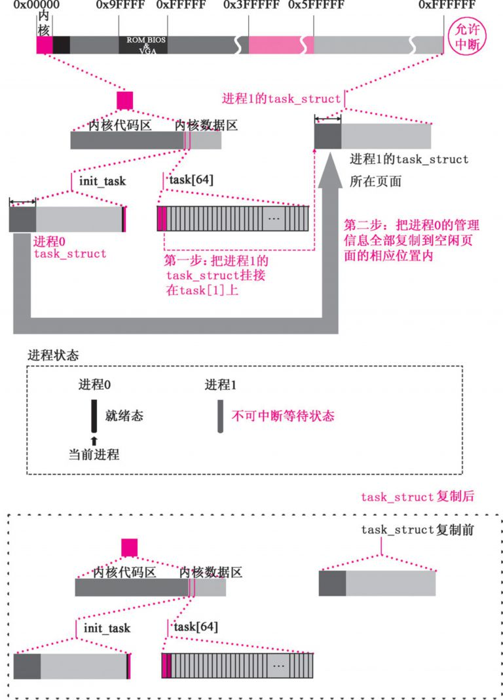

### Setup paging management
#### Initialize code segment and data segment
Apply `copy_mem()`, setup process 1's:
* code segment
* data segment's base address
* segment's limit

Source:

    int copy_process(int nr,long ebp,long edi,long esi,long gs,long none,
            long ebx,long ecx,long edx,
            long fs,long es,long ds,
            long eip,long cs,long eflags,long esp,long ss) {
        ...

        if (last_task_used_math == current)
            __asm__("clts ; fnsave %0"::"m" (p->tss.i387));

        // setup the code segment, data segment and create the
        // first page table of child process
        if (copy_mem(nr,p)) {
            task[nr] = NULL;
            free_page((long) p);
            return -EAGAIN;
        }

        // increase the count of file reference,
        // since the child process also referencing the
        // file that referenced by its parent.
        for (i=0; i<NR_OPEN;i++)
            if ((f=p->filp[i]))
                f->f_count++;
    }

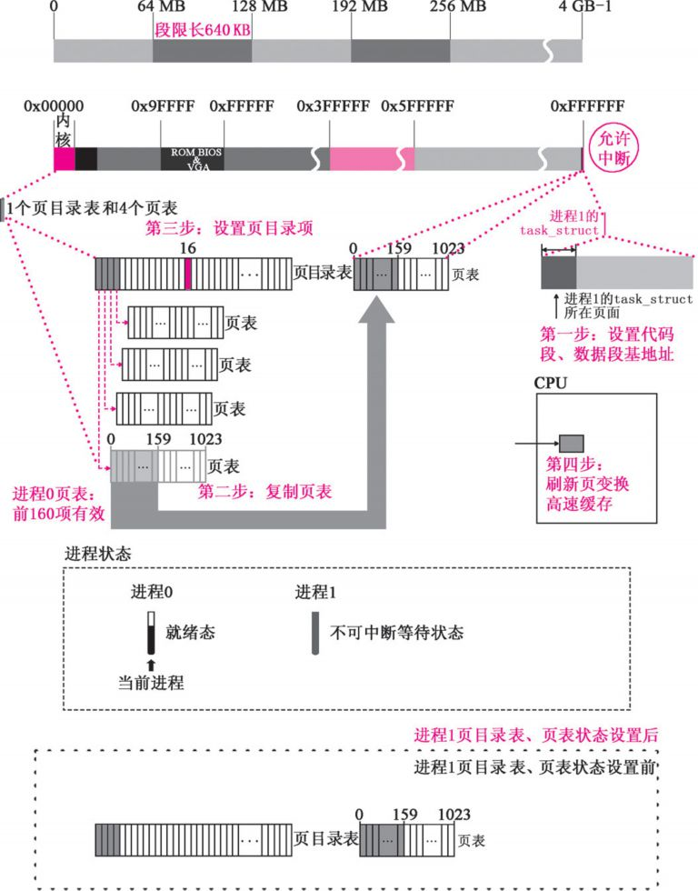

    // include/linux/sched.h
    ...
    #define _set_base(addr,base)  \  // use base to setup addr
    __asm__ ("push %%edx\n\t" \
        "movw %%dx,%0\n\t" \
        "rorl $16,%%edx\n\t" \
        "movb %%dl,%1\n\t" \
        "movb %%dh,%2\n\t" \
        "pop %%edx" \
        ::"m" (*((addr)+2)), \
         "m" (*((addr)+4)), \
         "m" (*((addr)+7)), \
         "d" (base) \
        )
    ...
    #define set_base(ldt,base) _set_base( ((char *)&(ldt)) , (base) )
    ...
    
    static inline unsigned long _get_base(char * addr) //get addr's base address
    {
             unsigned long __base;
             __asm__("movb %3,%%dh\n\t"
                     "movb %2,%%dl\n\t"
                     "shll $16,%%edx\n\t"
                     "movw %1,%%dx"
                     :"=&d" (__base)
                     :"m" (*((addr)+2)),
                      "m" (*((addr)+4)),
                      "m" (*((addr)+7)));
             return __base;
    }

    #define get_base(ldt) _get_base( ((char *)&(ldt)) )

    // get segment's limit
    #define get_limit(segment) ({ \
    unsigned long __limit; \
    __asm__("lsll %1,%0\n\tincl %0":"=r" (__limit):"r" (segment)); \
    __limit;})

    // kernel/fork.c
    // child process's code segment, data segment and copy the
    // child process's first page table (from parent's page table)
    int copy_mem(int nr,struct task_struct * p)
    {
        unsigned long old_data_base,new_data_base,data_limit;
        unsigned long old_code_base,new_code_base,code_limit;

        // get the limit of code and data segment
        code_limit=get_limit(0x0f);
        data_limit=get_limit(0x17);

        // parent process's code segment and data segment's addr
        old_code_base = get_base(current->ldt[1]); // ldt[1] code
        old_data_base = get_base(current->ldt[2]); // ldt[2] data
        if (old_data_base != old_code_base)
            panic("We don't support separate I&D");
        if (data_limit < code_limit)
            panic("Bad data_limit");
        // 0x4000000 is 64MB
        new_data_base = new_code_base = nr * 0x4000000;
        p->start_code = new_code_base;
        set_base(p->ldt[1],new_code_base); // set base of code segment
        set_base(p->ldt[2],new_data_base); // set base of data segment
        if (copy_page_tables(old_data_base,new_data_base,data_limit)) {
            printk("free_page_tables: from copy_mem\n");
            free_page_tables(new_data_base,data_limit);
            return -ENOMEM;
        }
        return 0;
    }

#### Create Page Table and Page Table Entry
The virtual address is split to page directory entry, page table entry and
offset. 

Page directory entry is in page directory table for  page table
management. 

Linux0.11 has one page directory table. With the virtual page directory number in
the virtual address, we can find the page directory entry. With the page
directory entry, we can find the page table, the page table number in the
virtual address, we can locate the page table entry. Concatenate the
offset, we can get physical address. Shown as follow. 

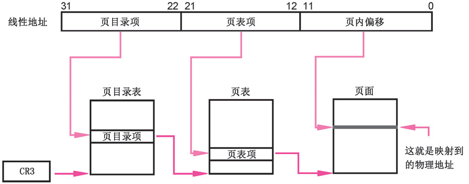

Call `copy_page_tables()` to setup page directory table and copy page
table. 
    
    int copy_mem(int nr, struct task_struct* p) {
        ...
        set_base(p->ldt[1],new_code_base); // set base of code segment
        set_base(p->ldt[2],new_data_base); // set base of data segment
        //create the first page table for child, copy parent's first page
        // table
        if (copy_page_tables(old_data_base,new_data_base,data_limit)) {
            printk("free_page_tables: from copy_mem\n");
            free_page_tables(new_data_base,data_limit);
            return -ENOMEM;
        }
        return 0;
    }

`copy_page_tables` will basically request a free page for the new page
table. 
1.  **copy** the first 160 items in the parent process to this page. (Each
    page table entry manage 4KB memory space, 160 page entries can manage
    640KB). Now parent and child's page table entries pointing to the same
    pages. 
* Then we setup child process's page directory table 
* Override `CR3` to update page switch cache. 

Source code:

    // mm/memory.c
    ...
    #define invalidate() \
    __asm__("movl %%eax,%%cr3"::"a" (0))
    ...

     *  Well, here is one of the most complicated functions in mm. It
     * copies a range of linerar addresses by copying only the pages.
     * Let's hope this is bug-free, 'cause this one I don't want to debug :-)
     *
     * Note! We don't copy just any chunks of memory - addresses have to
     * be divisible by 4Mb (one page-directory entry), as this makes the
     * function easier. It's used only by fork anyway.
     *
     * NOTE 2!! When from==0 we are copying kernel space for the first
     * fork(). Then we DONT want to copy a full page-directory entry, as
     * that would lead to some serious memory waste - we just copy the
     * first 160 pages - 640kB. Even that is more than we need, but it
     * doesn't take any more memory - we don't copy-on-write in the low
     * 1 Mb-range, so the pages can be shared with the kernel. Thus the
     * special case for nr=xxxx.
     */
    int copy_page_tables(unsigned long from,unsigned long to,long size) {
        unsigned long * from_page_table;
        unsigned long * to_page_table;
        unsigned long this_page;
        unsigned long * from_dir, * to_dir;
        unsigned long nr;

        /* 0x 3fffff is 4MB, the size managed by a page table
         * the last 22bits of from and to should b zero, multiples of 4MB
         * The continuous 4MB space corresponding to a page table has to be
         * start from 0x000000 and a multiple of 4MB */
        if ((from&0x3fffff) || (to&0x3fffff))
            panic("copy_page_tables called with wrong alignment");

        /**
         * A page table manage 4MB,  and an page table entry is 4 bits. So the entry address
         * is num of entry x 4. e.g. entry 0 at address 0, manage 0-4MB, entry
         * 1 at 4, manage 4-8MB, entry 2 at 8, 8-12MB and so on  >> 20 is the
         * num of MB 0xffc is 0b111111111100*/

        // >> 22 is number of 4MB, namely, entry number, copy from
        // get page table directory entry address from linear address
        // from_dir -- page table directory entry address to copy from
        // to_dir -- page table directory entry address to copy to
        from_dir = (unsigned long *) ((from>>20) & 0xffc); /* _pg_dir = 0 */
        to_dir = (unsigned long *) ((to>>20) & 0xffc);
        size = ((unsigned) (size+0x3fffff)) >> 22;

        for( ; size-->0 ; from_dir++,to_dir++) {
            if (1 & *to_dir)
                panic("copy_page_tables: already exist");
            if (!(1 & *from_dir))
                continue;

            // *from_dir is reference to the page directory entry, from
            // the entry we extract the page table address
            // 0xfffff000& is to clear the lower 12 bits. The higher 20bits
            // is the page table number.
            from_page_table = (unsigned long *) (0xfffff000 & *from_dir);
            
            // allocate memory for new page table
            if (!(to_page_table = (unsigned long *) get_free_page()))
                return -1;    /* Out of memory, see freeing */

            // setup the page directory entry. Note that to_dir is
            // pointing to the page directory entry, and it is extracted
            // from the linear address
            *to_dir = ((unsigned long) to_page_table) | 7; // 7 -> 111
            nr = (from==0)?0xA0:1024; // 0xA0, 160, number of entries to copy
            //copy page table from parent
            for ( ; nr-- > 0 ; from_page_table++,to_page_table++) {
                this_page = *from_page_table;
                if (!(1 & this_page))
                    continue;
                // setup page table attribute, ~2 is 101, user, read only, valid
                this_page &= ~2; 
                *to_page_table = this_page;
                if (this_page > LOW_MEM) { // LOW_MEM doesn't paginate
                    *from_page_table = this_page;
                    this_page -= LOW_MEM;
                    this_page >>= 12;
                    mem_map[this_page]++; // include reference count
                }
            }
        }
        invalidate(); //reset CR3 to 0
        return 0;
    }

### Process 1 share process 0's files
Setup the entries of `task_struct` that are related to file system. 
* opened files `p->flip[20]`
* Working directory's i-node struct
* Root directory i-node struct
* Executable file's i-node struct

Source code:

    int copy_process(int nr,long ebp,long edi,long esi,long gs,long none,
            long ebx,long ecx,long edx,
            long fs,long es,long ds,
            long eip,long cs,long eflags,long esp,long ss) {
        ...
        // increase the count of file reference,
        // since the child process also referencing the
        // file that referenced by its parent.
        for (i=0; i<NR_OPEN;i++)
            if ((f=p->filp[i]))
                f->f_count++;
        if (current->pwd)
            current->pwd->i_count++;
        if (current->root)
            current->root->i_count++;
        if (current->executable)
            current->executable->i_count++;
        // setup GDT's child process
        set_tss_desc(gdt+(nr<<1)+FIRST_TSS_ENTRY,&(p->tss));
        ...
    }

### Setup process 1's GDT
Setup process 1's `TSS` and `LDT` in `GDT`. As shown in the figure
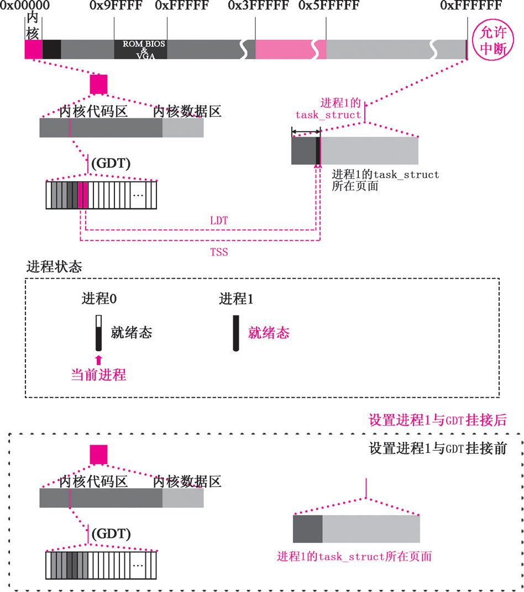

    int copy_process(int nr,long ebp,long edi,long esi,long gs,long none,
            long ebx,long ecx,long edx,
            long fs,long es,long ds,
            long eip,long cs,long eflags,long esp,long ss) {
    // setup GDT's child process
        set_tss_desc(gdt+(nr<<1)+FIRST_TSS_ENTRY,&(p->tss));
        set_ldt_desc(gdt+(nr<<1)+FIRST_LDT_ENTRY,&(p->ldt));
        p->state = TASK_RUNNING;    /* do this last, just in case */
        ...
        return last_pid;
    }

### Process 1 is ready
Now the creation of process 1 is done. `copy_process()` return to
`sys_fork()`:

    sys_fork:
        call find_empty_process
        testl %eax,%eax # if the returned value is -EAGAIN(11), there have
                        # been 64 processes running 
        js 1f
        push %gs        # next 5 pushes for copy_process's parameters
        pushl %esi
        pushl %edi
        pushl %ebp
        pushl %eax
        call copy_process 
        addl $20,%esp# copy_process return here, clear stacks
    1:	ret # edi ebp eax

Clear `sys_fork`'s 5 registers (gs, esi, edi, ebp, eax, the first 5
parameters of `copy_process`)

Note that `eax` correspond to `copy_process()`'s first parameter `nr`,
that is `last_pid`,  the return value of `copy_process`
    system_call:
        ...

        call *sys_call_table(,%eax,4) # call (_sys_call_table + 2x4, _sys_fork
        pushl %eax                    # sys_fork return here, eax is last_pid
        movl current,%eax 
        cmpl $0,state(%eax)           # state
        jne reschedule                # reschedule is process 0 is not ready
        cmpl $0,counter(%eax)         # counter
        je reschedule                 # process 0 doesn't have time slice
    ret_from_sys_call:
        movl current,%eax             # task[0] cannot have signals
        cmpl task,%eax
        je 3f                         # if current is process 0, jump to 3
        cmpw $0x0f,CS(%esp)           # was old code segment supervisor ?
        jne 3f
        cmpw $0x17,OLDSS(%esp)        # was stack segment = 0x17 ?
        jne 3f
        movl signal(%eax),%ebx
        movl blocked(%eax),%ecx
        notl %ecx
        andl %ebx,%ecx
        bsfl %ecx,%ecx
        je 3f
        btrl %ecx,%ebx
        movl %ebx,signal(%eax)
        incl %ecx
        pushl %ecx
        call do_signal
        popl %eax
    3:	popl %eax                      # process 0 jump here, pop to registers
        popl %ebx
        popl %ecx
        popl %edx
        pop %fs
        pop %es
        pop %ds
        iret

Since current process is 0, so jump to label 3, recover the register
values from stack. 

`iret` return the interrupt, CPU hardware recover the `ss`, `esp`,
`eflags`, `cs`, `eip` from stack to registers. Flip the privilege level
back to `3`. `CS:EIP` point to the next line of `int 0x80` in `fork()`':

    //include/unistd.h
    int fork(void) {
        long __res; 
    // int 0x80 is the entrance of system call
        __asm__ volatile ("int $0x80"
            : "=a" (__res)  // output part, _res value assigned to eax
            : "0" (2));     // input part, assign __NR_fork to eax
        if (__res >= 0)    // interruption return, __res's value is eax(1)
            return (int) __res;  // return 1 for parent process
        errno = -__res; 
        return -1; 
    }

Then return to main:
    void main(void) {
        sti()
        move_to_user_mode();
        if(!fork()) { // fork return 1 for parent
            init(); // won't exec this line
        }
        ...
        for(;;) pause();
    }

## First Process Scheduling
Now, switch from process 0 to process 1

Two cases to cause content switch:
1. Time allowed for process execute expire. (round-robin)
* Process stop running.

Process 0 execute `for(;;) pause()` until `schedule()` switch context. 

`pause`

    // init/main.c
    ...
    static inline _syscall0(int, fork)
    static inline _syscall0(int, pause)
    ...
    void main(void) {
    ...
        move_to_user_mode();
        if(!fork()) {
            init();
        }
        for(;;) pause();
    }

Through `int 0x80` interrupt, map `call _sys_call_table(,%eax,4)` in
`system_call.s` to `sys_pause()`, the system call method.  

`sys_pause()` set process 0 to interruptible sleep. 

Note: linux process state codes:
    PROCESS STATE CODES
       R  running or runnable (on run queue)
       D  uninterruptible sleep (usually IO)
       S  interruptible sleep (waiting for an event to complete)
       Z  defunct/zombie, terminated but not reaped by its parent
       T  stopped, either by a job control signal or because
          it is being traced
       [...]

    // kernel/sched.c
    int sys_pause(void)
    {
        // set process to interruptible sleep
        // only interrupt or signal from other process
        // can change this state to ready.
        current->state = TASK_INTERRUPTIBLE;
        schedule();
        return 0;
    }

`schedule()` function decide to switch process or not. 
Traverse all processes in `task[64]`. Handle the alarm and signals.

Traverse the processes for the second time, compare the states and time
slices. Find the ready process with highest counter. Execute
`switch_to(next)`

Source code:

    void schedule(void) {
        int i,next,c;
        struct task_struct ** p;

    /* check alarm, wake up any interruptible tasks that have got a signal */

        for(p = &LAST_TASK ; p > &FIRST_TASK ; --p)
            if (*p) {
                if ((*p)->alarm && (*p)->alarm < jiffies) { // if alarm is set or passed
                        (*p)->signal |= (1<<(SIGALRM-1));   // set SIGALARM
                        (*p)->alarm = 0;                    // clear alarm
                    }
                if (((*p)->signal & ~(_BLOCKABLE & (*p)->blocked)) &&
                (*p)->state==TASK_INTERRUPTIBLE)
                    (*p)->state=TASK_RUNNING;
            }

    /* this is the scheduler proper: */

        while (1) {
            c = -1;
            next = 0;
            i = NR_TASKS;
            p = &task[NR_TASKS];
            while (--i) {
                if (!*--p)
                    continue;
                if ((*p)->state == TASK_RUNNING && (*p)->counter > c)
                    c = (*p)->counter, next = i;
            }
            if (c) break;
            for(p = &LAST_TASK ; p > &FIRST_TASK ; --p) // find the ready process with largest counter
                if (*p)
                    (*p)->counter = ((*p)->counter >> 1) +
                            (*p)->priority;
        }
        switch_to(next);
    }
    // include/linux/sched.h
    /*
     *	switch_to(n) should switch tasks to task nr n, first
     * checking that n isn't the current task, in which case it does nothing.
     * This also clears the TS-flag if the task we switched to has used
     * tha math co-processor latest.
     */
    #define switch_to(n) {\
    struct {long a,b;} __tmp; \                // prepare CS and EIP for ljmp
    __asm__("cmpl %%ecx,current\n\t" \
        "je 1f\n\t" \                          // do nothing if n is current
        "movw %%dx,%1\n\t" \                   // assign CS to __tmp.b
        "xchgl %%ecx,current\n\t" \            // exchange task[n] and task[current]
        "ljmp *%0\n\t" \                       // ljmp to __tmp, __tmp has offset and segment selector
        "cmpl %%ecx,last_task_used_math\n\t" \ // used coprocessor or not
        "jne 1f\n\t" \
        "clts\n" \                             // clear CR0
        "1:" \
        ::"m" (*&__tmp.a),"m" (*&__tmp.b), \
        "d" (_TSS(n)),"c" ((long) task[n])); \ // EDX point to task[n]
    }

`ljmp` save the values of registers to process 0's `TSS`, load the value
of process 1's `TSS` and `LDT`'s code segment and data segment to CPU's
register, and flip from privilege 0 to privilege 3. 

Note, `pause()` is called by flipping from privilege `3` to process `0`. 

## Execution of process 1
Process 0 (`init_task`) created `tss.eip` for process 1. This value point
to the next line of `int 0x80`, namely `if (__res >= 0)`.

    #define _syscall0(type,name) \
      type name(void) \
    { \
    long __res; \
    __asm__ volatile ("int $0x80" \
        : "=a" (__res) \
        : "0" (__NR_##name)); \
    if (__res >= 0) \           // process 1 start from here
        return (type) __res; \
    errno = -__res; \
    return -1; \
    }

The value of `__res` is the value of `tss.eax` of process 1, this value is
set to `0`, namely `p->tss.eax = 0`. So `return (type) __res` will return
zero. 

For process 1:
    void main(void) {
    ...
        if(!fork()) {
            init(); // this line will be executed for process 1
        }
    }

After entering `init()`, `setup()` is the first function to call. 

    void init(void) {
        ...
        setup((void *) &drive_info);
        ...
    }

Note: the interrupt generated by `pause()` haven't return yet, yet
`setup()` generates another interrupt.

### Process 1 prepare for installing file system 
Basically 3 steps:

1. Setup hard disk parameter.
* Read hard disk boot block.
* Gain information from boot sector. 

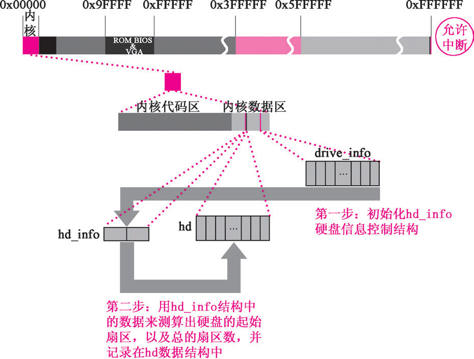

#### setup `hd_info`
Code:

    // kernel/blk_dev/hd.c
    ...
    /*
     *  This struct defines the HD's and their types.
     */
    struct hd_i_struct {
        int head,sect,cyl,wpcom,lzone,ctl;
        };
    ...
    struct hd_i_struct hd_info[]={{0,0,0,0,0,0,0},{0,0,0,0,0,0,0}};
    ...
    static struct hd_struct {
        long start_sect;  // start sector number
        long nr_sects;    // number of total sectors
    } hd[5*MAX_HD]={{0,0},};
    ...
    /* This may be used only once, enforced by 'static int callable' */
    int sys_setup(void * BIOS) // BIOS is drive_info
    {
        static int callable = 1;
        int i,drive;
        unsigned char cmos_disks;
        struct partition *p;
        struct buffer_head * bh;

        if (!callable) // make sure that only called once.
            return -1;
        callable = 0;
    #ifndef HD_TYPE
        for (drive=0 ; drive<2 ; drive++) {
            hd_info[drive].cyl = *(unsigned short *) BIOS; // cylinder num
            hd_info[drive].head = *(unsigned char *) (2+BIOS); // head num
            hd_info[drive].wpcom = *(unsigned short *) (5+BIOS);
            hd_info[drive].ctl = *(unsigned char *) (8+BIOS);
            hd_info[drive].lzone = *(unsigned short *) (12+BIOS);
            hd_info[drive].sect = *(unsigned char *) (14+BIOS); // sector num in each track
            BIOS += 16;
        }
        if (hd_info[1].cyl)
            NR_HD=2;
        else
            NR_HD=1;
    #endif
        // Four logical disk for each physical disk.
        // 0 -- physical disk
        // 1-4 -- logical disks
        // Total 5 disks for each physical disk
        // Therefore, the first physical disk is 0*5, the second is 1*5
        for (i=0 ; i<NR_HD ; i++) {
            hd[i*5].start_sect = 0;
            hd[i*5].nr_sects = hd_info[i].head*
                    hd_info[i].sect*hd_info[i].cyl;
        }

        /*
            We query CMOS about hard disks : it could be that
            we have a SCSI/ESDI/etc controller that is BIOS
            compatible with ST-506, and thus showing up in our
            BIOS table, but not register compatible, and therefore
            not present in CMOS.

            Furthermore, we will assume that our ST-506 drives
            <if any> are the primary drives in the system, and
            the ones reflected as drive 1 or 2.

            The first drive is stored in the high nibble of CMOS
            byte 0x12, the second in the low nibble.  This will be
            either a 4 bit drive type or 0xf indicating use byte 0x19
            for an 8 bit type, drive 1, 0x1a for drive 2 in CMOS.

            Needless to say, a non-zero value means we have
            an AT controller hard disk for that drive.

        */

        if ((cmos_disks = CMOS_READ(0x12)) & 0xf0)
            if (cmos_disks & 0x0f)
                NR_HD = 2;
            else
                NR_HD = 1;
        else
            NR_HD = 0;
        for (i = NR_HD ; i < 2 ; i++) {
            hd[i*5].start_sect = 0;
            hd[i*5].nr_sects = 0;
        }
        // first physical disk with device number 0x300,
        // the second is 0x305
        // Read the 0 sector of each disk has the partition info
        for (drive=0 ; drive<NR_HD ; drive++) {
            if (!(bh = bread(0x300 + drive*5,0))) {
                printk("Unable to read partition table of drive %d\n\r",
                    drive);
                panic("");
            }
            if (bh->b_data[510] != 0x55 || (unsigned char)
                bh->b_data[511] != 0xAA) {
                printk("Bad partition table on drive %d\n\r",drive);
                panic("");
            }
        ...
    }

#### Read boot sector to buffer 
In Linux 0.11, the most basic information to hard disk is the partition
table. Each disk has an unique boot block, namely the 0 logic block of the
hard disk. There are two sectors for boot block, only the first sector is
useful. Note that we use `bread` to implement the process of reading the
boot block to buffer, `bread()` can be understood as *block read*

    // kernel/blk_dev/hd.c:
    ...

    for (drive=0 ; drive<NR_HD ; drive++) {
        if (!(bh = bread(0x300 + drive*5,0))) {
            printk("Unable to read partition table of drive %d\n\r",
                drive);
            panic("");
        }
        if (bh->b_data[510] != 0x55 || (unsigned char)
            bh->b_data[511] != 0xAA) {
            printk("Bad partition table on drive %d\n\r",drive);
            panic("");
        }
    ...
    }

After entering `bread()`, first call `getblk()` to request for a free
buffer block

    //fs/buffer.c
    /*
     * bread() reads a specified block and returns the buffer that contains
     * it. It returns NULL if the block was unreadable.
     */
    // read specified dev, block, the first hard disk is 0x300, block is
    struct buffer_head * bread(int dev,int block)
    {
        struct buffer_head * bh;

        if (!(bh=getblk(dev,block))) // get the buffer block corresponding to dev and block
            panic("bread: getblk returned NULL\n");
        if (bh->b_uptodate)
            return bh;
        ll_rw_block(READ,bh);
        wait_on_buffer(bh);
        if (bh->b_uptodate)
            return bh;
        brelse(bh);
        return NULL;
    }

In `getblk()`, first call `get_hash_table()` to check for whether the
block has been loaded into buffer or not. If yes, don't need to load from
the disk again. 
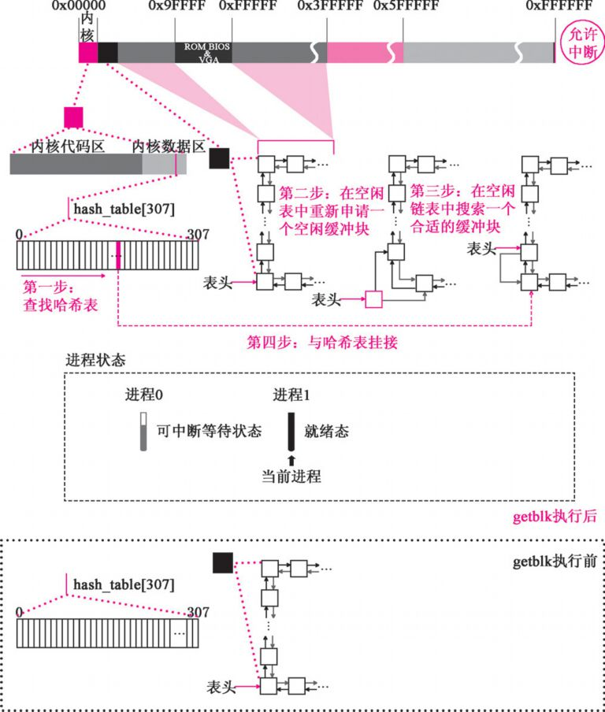

    
    /*
     * Ok, this is getblk, and it isn't very clear, again to hinder
     * race-conditions. Most of the code is seldom used, (ie repeating),
     * so it should be much more efficient than it looks.
     *
     * The algoritm is changed: hopefully better, and an elusive bug removed.
     */
    #define BADNESS(bh) (((bh)->b_dirt<<1)+(bh)->b_lock)
    struct buffer_head * getblk(int dev,int block)
    {
        struct buffer_head * tmp, * bh;

    repeat:
        if ((bh = get_hash_table(dev,block)))
            return bh;
        tmp = free_list;
        do {
            if (tmp->b_count)
                continue;
            if (!bh || BADNESS(tmp)<BADNESS(bh)) {
                bh = tmp;
                if (!BADNESS(tmp))
                    break;
            }
            ...
        }

Call `find_buffer()` in `get_hash_table` to check buffer block for
specific device number and block number. If found, use it directly

    /*
     * Why like this, I hear you say... The reason is race-conditions.
     * As we don't lock buffers (unless we are readint them, that is),
     * something might happen to it while we sleep (ie a read-error
     * will force it bad). This shouldn't really happen currently, but
     * the code is ready.
     */
    struct buffer_head * get_hash_table(int dev, int block)
    {
        struct buffer_head * bh;

        for (;;) {
            if (!(bh=find_buffer(dev,block)))
                return NULL;
            bh->b_count++;
            wait_on_buffer(bh);
            if (bh->b_dev == dev && bh->b_blocknr == block)
                return bh;
            bh->b_count--;
        }
    }

For process one, the buffer doesn't have any buffer block, so the
`find_buffer()` will return `NULL`

    // fs/buffer.c
    // NR_HASH is 307
    // e.g. if dev is 0x300 and block is 0, _hashfn(dev, block) is 154
    #define _hashfn(dev,block) (((unsigned)(dev^block))%NR_HASH)
    #define hash(dev,block) hash_table[_hashfn(dev,block)]
    ...
    // find buffer block of specified dev, block
    static struct buffer_head * find_buffer(int dev, int block)
    {
        struct buffer_head * tmp;

        for (tmp = hash(dev,block) ; tmp != NULL ; tmp = tmp->b_next)
            if (tmp->b_dev==dev && tmp->b_blocknr==block)
                return tmp;
        return NULL;
    }

After returning from `find_buffer()` and `get_hash_table()`, the system
continue `getblk()` function. It will then request a free buffer bloc. 

    /*
     * Now d_dirt, and b_block are 0, so BADNESS(bh) is 00
     */
    #define BADNESS(bh) (((bh)->b_dirt<<1)+(bh)->b_lock)
    struct buffer_head * getblk(int dev,int block)
    {
        struct buffer_head * tmp, * bh;

    repeat:
        if ((bh = get_hash_table(dev,block)))
            return bh;
        tmp = free_list;
        do {
            if (tmp->b_count) // tmp->b_count is now zero
                continue;
            if (!bh || BADNESS(tmp)<BADNESS(bh)) { // bh is zero
                bh = tmp;
                if (!BADNESS(tmp)) // now BADNESS(tmp) is 00, got buffer block
                    break;
            }
    /* and repeat until we find something good */
        } while ((tmp = tmp->b_next_free) != free_list);
        if (!bh) {
            sleep_on(&buffer_wait);
            goto repeat;
        }
        wait_on_buffer(bh);
        if (bh->b_count)
            goto repeat;
        while (bh->b_dirt) {
            sync_dev(bh->b_dev);
            wait_on_buffer(bh);
            if (bh->b_count) // we haven't put free block to hash table yet.
                goto repeat;
        }
    /* OK, FINALLY we know that this buffer is the only one of it's kind, */
    /* and that it's unused (b_count=0), unlocked (b_lock=0), and clean */
    // add the free block to the hash table
        bh->b_count=1;
        bh->b_dirt=0;
        bh->b_uptodate=0;
        remove_from_queues(bh);
        bh->b_dev=dev;
        bh->b_blocknr=block;
        insert_into_queues(bh);
        return bh;
    }

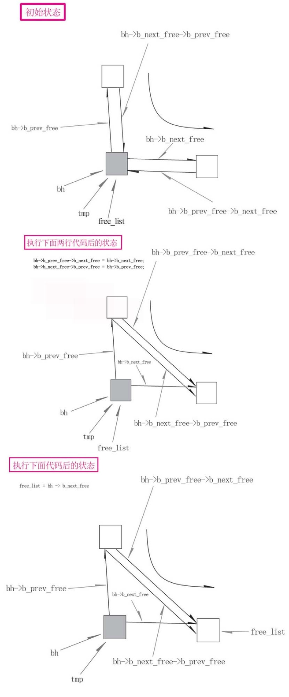

    // fs/buffer.c
    ...
    static inline void remove_from_queues(struct buffer_head * bh)
    {
    /* remove from hash-queue */
        if (bh->b_next)
            bh->b_next->b_prev = bh->b_prev;
        if (bh->b_prev)
            bh->b_prev->b_next = bh->b_next;
        if (hash(bh->b_dev,bh->b_blocknr) == bh)
            hash(bh->b_dev,bh->b_blocknr) = bh->b_next;
    /* remove from free list */
        if (!(bh->b_prev_free) || !(bh->b_next_free))
            panic("Free block list corrupted");
        bh->b_prev_free->b_next_free = bh->b_next_free;
        bh->b_next_free->b_prev_free = bh->b_prev_free;
        if (free_list == bh)
            free_list = bh->b_next_free;
    }
    ...

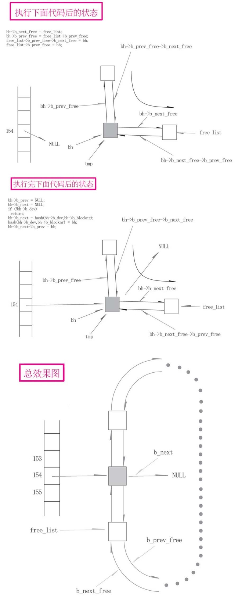

    // fs/buffer.c
    ...
    static inline void insert_into_queues(struct buffer_head * bh)
    {
    /* put at end of free list */
        bh->b_next_free = free_list;
        bh->b_prev_free = free_list->b_prev_free;
        free_list->b_prev_free->b_next_free = bh;
        free_list->b_prev_free = bh;
    /* put the buffer in new hash-queue if it has a device */
        bh->b_prev = NULL;
        bh->b_next = NULL;
        if (!bh->b_dev)
            return;
        bh->b_next = hash(bh->b_dev,bh->b_blocknr);
        hash(bh->b_dev,bh->b_blocknr) = bh;
        bh->b_next->b_prev = bh;
    }

After `getblk()`, return to `bread()`

#### Link the block the request
After returning from `bread()`, call `ll_rw_block()`, As shown in the
following figure:
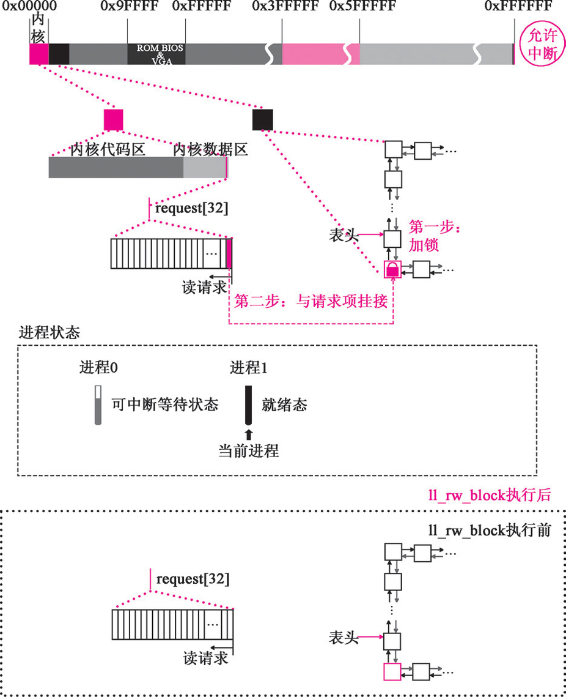

So after that, the buffer blocks are associated with the request entry
(for hard disk reading).

Steps:
1. In `struct buffer_head bread(int dev, int block)`, call `ll_rw_block()`
   to associate buffer with request
* In `ll_rw_block`, if the corresponding device exists and the request
  function is correctly associated, we can operate the buffer by calling 
  `make_request`
* In `make_reqest()`, we first lock the buffer, to protect it from
  being operated by other processes. Then add the request to the request
  queue `reqest[32]`, by calling `add_reqest()`
*  `add_request` will analysis the current hard disk state, and set the
   passed request to be the current request item. It will then call
   `(dev->request_fn)()` (namely, `do_hd_request()` to send command to the
   hard disk.

#### Read hard disk
`do_hd_request()` will do the final preparation for reading disk.

Steps:
1. Parse the `hd_info`, extract hard disk information such as `sector`,
   `cylinder` and so on. 
* Send command to hard disk by calling `hd_out()`. `WIN_READ` means that
  it's reading operation. `read_intr()` is the interrupt routine for disk
  reading. So we associate it with `hd_out()`. To write disk, we use
  `write_intr()`
* `hd_out()` will do the last step: send read disk command. It will assign
  the `intr_addr` to `do_hd` and execute `_hd_interrupt` in
  `kernel/system_call.s`
* `ll_rw_block()` return to `bread()`, and call `wait_on_buffer(bh)`
* In `wait_on_buffer()`, if the buffer is locked, call `sleep_on()`
* `sleep_on` will then set the current task (process 1) to be
  `TASK_UNINTERRUPTIBLE`, then call `schedule()` to switch to process `0`.

In `do_hd_request()`:
    if(CURRENT->cmd == WRITE) {
        hd_out(dev, nsect,sec,head,cyl,WIN_WRITE, &write_intr);
        ...
    } else if (CURRENT->cmd == READ) {
        hd_out(dev,nsect, sec, head, cyl, WIN_READ, &read_intr);
    }
#### Switch to process 0 while waiting for disk reading
When entering the `schedule()` function, the current process is switched
to process 0.

Note that if there are no proper tasks, the `schedule()` function will
force it to switch to process 0. `switch_to(next)` will be `0` in this
case. 

#### Hard disk interrupt while executing process 0
When hard disk read the data from some sector, a hard disk interrupt will
occur.

1. When CPU receive the interrupt, it will stop the current program. The
   stop point must be in one of `pause()`, `sys_pause()`, `scheduel()`,
   `switch_to(n)`'s cycle. Then it goes to execute `_hd_interrupt`
* Interrupt will automatically push `ss`, `esp`, `eflags`, `cs`, `eip`. 
* `read_intr()` function will copy the data in the hard disk buffer into
  the locked buffer block. 
* The process will be repeated until all the requested data has been
  extracted.
* Finally, it will call `end_request(1)`
* `end_request()` will set the flag `b_updodate` to 1. Meaning it can be
  operated now. Then it will call `unlock_buffer` (`end_request` in
  `kernel/blk_dev/blk.h`)
* In `unlock_buffer()`, it will call `wake_up(&bh->b_wait)`.
  (`unlock_buffer()` in `kernel/blk_dev/blk.h`)
* `wake_up` will set the process to ready state. (code in `kernel/sched.c`)

#### After reading disk, scheduler switch back to process 1
After reading disk, the function will be returned to `sys_setup(void* BIOS)`
Make use of the information from boot sector to setup `hd[]`. 

### Process 1 format `ramdisk` and change the root device to be ramdisk.
Note current root device is floppy disk. 

1. `sys_setup` (`kernel/blk_dev/hd.c`) call `rd_load()`
* `rd_load()` calls `breada()` function to read data for formating
  ramdisk.  (`rd_load()` and `breada()` in `kernel/blk_dev/ramdisk.c`)

### Process load root File System in Root Device
The file system of an OS can be divided into two parts: one in the kernel,
the other in hard disk, floppy disks, and ramdisks.

File System makes use of i-nodes to manage files. I-nodes and files have
one-to-one correspondence.  

As shown in the following figure:
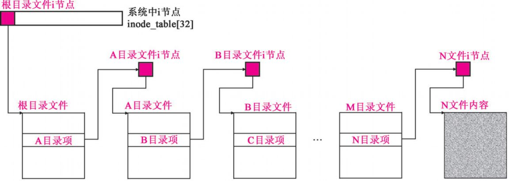

So all the files (including directory)'s i-node formed a tree structure.
The root of the tree is the root i-node of the file system. A logic device
can have exactly one file system. 

Loading file system is equivalent to mounting a file system's root i-node
to an i-node of another file system. As shown in the following figure:
 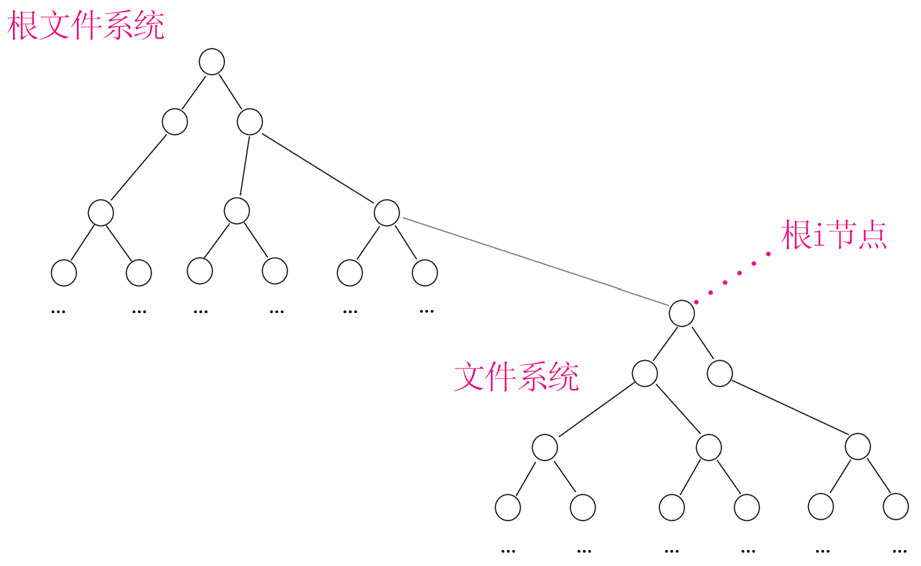

So a file system must be mounted on another file system, then there must
be a file system that can only be mounted by other file systems. This file
system is called root file system. It is mounted on `super_block[8]`

Linux 0.11 has only one `super_block[8]`, each element is a super block,
with exactly one root device. Load root file system is equivalent to mount
the root i-node to `super_block[8]`'s corresponding block.

Therefore, 3 main steps:
1. copy the root device's super block into `super_block[8]`, mount root
   device's root i-node onto `super_block[8]`'s corresponding super block.
* setup `s_zmap[8]` and `s_imap[8]` on `super_block[8]`. 
* Set the pointers, `pwd` and `root` , of current process to root device's
  root i-node.

Those steps are done in `mount_root` (`fs/super.c`):
1. `mount_root()` initialize `super_block[8]` by setting `p->s_dev = 0`,
   `p->s_lock=0`, `p->s_wait = NULL`
* call `read_super()` (`fs/super.c`) to load the super block of root
  device into `super_block[8]`

Note:
The superblock object is implemented by each filesystem and is used to
store information describing that specific filesystem.This object usually
corresponds to the filesystem superblock or the filesystem control block,
which is stored in a special sector on disk (hence the object’s name)

