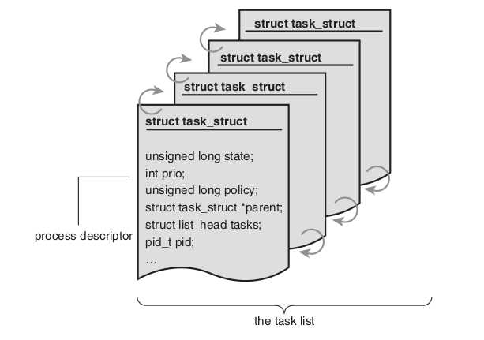
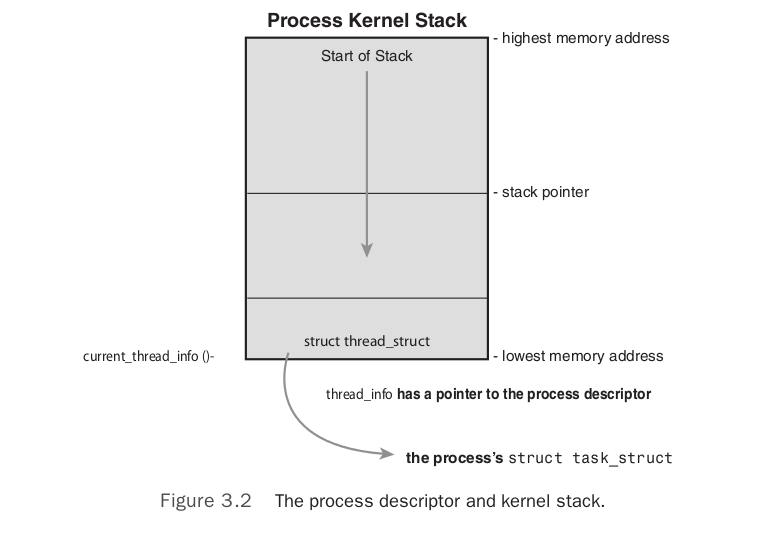
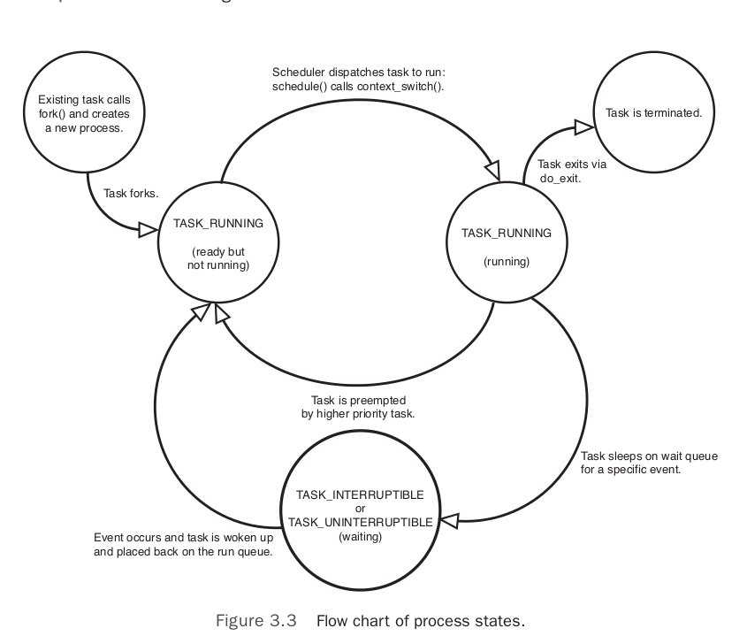

# Process Management
A *process* is a program in the midst of execution, which program clde is
called *text section* in linux. (active program + related resources)

Threads of execution, often shortened to be *threads*, are the objects of
activity within the process. 

Each thread includes:

* A unique program counter
* process stack
* a set of processor registers

Two virtualizations:

* virtualized processor: give process the illusion that it alone
  monopolizes the system.
* virtualized memory: lets the process allocate and manage memory as if it
  alone owned all the memory in the system.

## Process Descriptor and Task Structure
Kernel stores the list of processes in a circular double linked list
called `task_list`, each element is a *process descriptor* of type `struct
task_struct` (`<linx/sched.h>`)

It contains:

* open files
* process's address space
* pending signals
* process's state
* and much more, as shown in the figure

### Allocating the Process Descriptor
The `task struct` is allocated via the *slab allocator* to provide object
reuse and cache coloring. Prior to 2.6 kernel, `struct task_struct` was stored at the end of the
kernel stack of each process. With the process descriptor now dynamically
created via the slab allocator, a new structure `struct thread_info` was
created that again lives at the bottom of the stack (for stacks that grow
down) and at the top of the stack (for stacks that grow up). See figure:

The `thread_info` is defined in `<asm/thread_info.h>`:

    struct thread_info {
        struct task_struct *task;
        struct exec_domain *exec_domain;
        __u32 flags;
        __u32 status;
        __u32 cpu;
        int preempt_count;
        mm_segment_t addr_limit;
        struct restart_block restart_block;
        void *sysenter_return;
        int uaccess_err;
    }

Each task's `thread_info` structure is allocated at the end of its stack.
The `task` element points to the actual `task_struct`.

### Storing the Process Descriptor
The sys identifies process by PID of tyep `pid_t`

Inside the kernel, tasks are typically referenced directly by a pointer to
their `task_struct` structure.  The `current` macro is for quickly
reference to the current executing task. 

On x86, `current` is calculated by masking out the 13 least-significant
bits of the stack pointer to obtain the `thread_info` structure. (`struct
thread_info` is stored on the kernel stack). This is done by
`current_thread_info()`:

    movl $-8192, %eax
    andl %esp, %eax

Finally `current` dereferences the `task` member of `thread_info` to
return the `task_struct`:

    current_thread_info()->task;

### Process State
* `TASK_RUNNING`: the process is runnable. (running or on a run-queue)
* `TASK_INTERRUPTIBLE`: The process is sleeping, waiting for some
  condition to exist. When this condition exists, the kernel sets the
  process's state to `TASK_RUNNING`
* `TASK_UNINTERRUPTIBLE`: does not wake up and become running if it
  receives a signal. 
* `__TASK_TRACED`: being *traced* by another process, such as a debugger,
  via *ptrace*.
* `__TASK_STOPPED`: occurs if the task receives `SIGSTOP`, `SIGTSTP`,
  `SIGTTIN` or `SIGTTOU`

## Process Creation
Unix separating these steps into two distinct functions:`fork()` and
`exec()`. `fork()` copies parent and `exec()` loads a new executable. 

### Copy-on-Write
In Linux, `fork()` is implemented through the use of `copy-on-write`
pages.  The data is marked in such a way that if it si written to, a
duplicate is made and each process receives a unique copy. Until then,
they are shared read-only.

The only overhead incurred by `fork()` is the duplication of parent's page
tables and creation of uniqu process descriptor for the child.

### Forking
Linux implements `fork()` via the `clone()` system call. This call takes a
series of flags that sepcify which recources the parent and child process
should share. The `clone()` system call, in term, calls `do_fork()`
(defined in `kernel/fork.c`). This function call `copy_process()` and then
starts the process running.

Work done by `copy_process()`:

1. calls `dup_task-struct()`, which creates new:
    - kernel stack
    - `thread_info` structure
    - `task_struct` for new process. 
   Values are identical to current process.
* Check the new child not exceed the resource limit.
* Various members of the new process descriptor are cleared or set to
  initial values.  The bulk of the values in `task_struct` remain
  unchanged.
* Child's state is set to `TASK_UNINTERRUPTIBLE`
* `copy_process` calls `copy_flags()`. The `PF_SUPERPRIV` flag, which
  denotes the superuser privileges, is cleared. The `PF_FORKNOEXEC` which
  denotes a process that has not called `exec()` is set.
* It calls `alloc_pid()` to assign an available PID to the new task
* Depending on the flags passed to `clone()`, `copy_process()` either
  duplicates or shares open files, filesystem information, singal
  handlers, process address space, and namespace.
* Finally, `copy_process()` cleans up and returns to the caller a pointer
  to the new child.

Back in `do_fork()` , if `copy_process()` returns successfully, the new child is woken up
and run. Deliberately, the kernel runs the child process first. 8 In the common case of the
child simply calling `exec()` immediately, this eliminates any copy-on-write overhead that
would occur if the parent ran first and began writing to the address space.

## The Linux Implementation of Threads
Linux implements all threads as standard processes. A thread is merely a
process that shares certain resources with other processes.
### Creating Threads
Threads are created the same as normal tasks, with the exception that the
`clone()` system call is passed flags corresponding to the specific
resources to be shared:

    clone(CLONE_VM | CLONE_FS | CLONE_FILES | CLONE_SIGHAND, 0);

Results identical to `fork()`, except that the address space, filesystem
resources, file descriptors, and signal handlers are shared.

### Kernel Threads
Kernel threads: standard processes that exist solely in kernel space.
Kernel threads do not have an address space. (Their `mm` pointer, which
points at their address space, is `NULL`) The operate only in kernel-space
and do not context switch into user space. Kernel threads are schedulable
and preemptable.

Linux delegates several tasks to kernel threads, most notably the *flush*
tasks and the *ksoftirqd* tasks. See kernel threads by `ps -ef`

Indeed, a kernel thread can be created only by another kernel thread.The
kernel handles this automatically by forking all new kernel threads off of
the *kthreadd* kernel process.The interface, declared in `<linux/kthread.h>` ,
for spawning a new kernel thread from an existing one is

    ruct task_struct *kthread_create(int (*threadfn)(void *data),
                                    void *data,
                                    const char namefmt[],
                                    ...)

The new task is created via the `clone()` system call by the `kthread`
kernel process. The new process will run the `threadfn` function, which is
passed the `data` argument.

## Process Termination
When a process terminates, the kernel releases the resources owned by the
process and notifies the child's parent of its demise.

Generally, process destruction is self-induced. It occurs when it calls
`exit()` system call.

A process can also terminate involuntarily. When it receives a signal or
exception it cannot handle or ignore.

The bulk of work is handled by `do_exit()` for both, defined in
`kernel/exit.c`:

1. It sets `PF_EXITING` flag in the `flags` member of the `task_struct`
* it calls `del_timer_sync()` to remove any kernel times. Upon return, it
  is guaranteed that no timer is queued and that no timer handler is
  running. 
* If BSD process accounting is enabled, `do_exit()` calls
  `acct_update_integrals()` to write out accounting information.
* It calls `eixt_mm()` to release the `mm_struct` held by this process. If
  the address space is not shared, the kernel destroys it.
* It calls `exit_sem()` if the process is queued waiting for an IPS
  semaphore.
* It then calls `exit_files()` and `exit_fs()` to decrement the usage
  count of objects related to file descriptors and filesystem data,
  respectively. 
* It sets the task's exit code, stored in the `exit_code` member of the
  `task_struct` to the code provided by `exit()` or whatever kernel
  mechanism forced to termination.
* It calls `exit_notify()` to send signals to the task's parent. Reparents
  any of the task's children to another thread in their thread group or
  init process, and sets the task's exit state, store the `exit_state` in
  the `task_struct` structure, to `EXIT_ZOMBIE`
* `do_exit()` calls `schedule()` to switch a new process. The process is
  not schedulable, this is the last code the task will ever execute.
  `do_exit()` never returns.

  At this point, the process is in `EXIT_ZOMBIE` exit state.

  The only memory it occupies is its kernel stack, the `thread_info`
  structure, and the `task_struct` structure. The task exists solely to
  provide information to tis parent. 

  After the parent retrieves the information, or notifies the kernel that
  it is uninterested, the remaining memory held by the process is freed
  and returned to the system for use. 

### Removing the Process Descriptor
The `wait()` family of functions are implemented via a single system call,
`wait4()`. The standard behavior is to suspend execution of the calling
task until one of its children exits, at which time the function returns
with the PID of the exit child. 

When it is time to finally deallocate the process descriptor,
`release_task()` is invoked:

1. it calls `__exit_signal()`, which calls `__unhash_process()`, which in
   turns calls `detach_pid()` to remove the process from the pidhash and
   remove the process from the task list.
* `__exit_signal()` releases any remaining resources. 
* `release_task()` notifies the zombie leader's parent.
* `release_task()` calls `put_task_struct()` to free the pages containing
  the process's kernel stack and `thread_info` structure and deallocate
  the slab cache containing the `task_struct`

### The Dilemma of the Parentless Task
If a parent exits before its children, some mechanism must exist to reparent any child tasks
to a new process, or else parentless terminated processes would forever remain zombies,
wasting system memory.The solution is to reparent a task’s children on exit to either
another process in the current thread group or, if that fails, the `init` process.

`do_exit()` calls `exit_notify`, which calls `forget_original_parent()`
which, in turn, calls `find_new_reaper()` to perform reparenting.

    static struct task_struct *find_new_reaper(struct task_struct *father)
    {
        struct pid_namespace *pid_ns = task_active_pid_ns(father);
        struct task_struct *thread;

        thread = father;
        while_each_thread(father, thread) { //  while ((thread = next_thread(thread)) != father)
            if (thread->flags & PF_EXITING)
                continue;
            if (unlikely(pid_ns->child_reaper == father))
                pid_ns->child_reaper = thread;
            return thread;
        }

        if(unlikely(pid_ns->child_reaper == father)) {
            write_unlock_irq(&tasklist_lock);
            if(unlikely(pid_ns == &init_pid_ns)) 
                panic("Attempted to kill init!");
            zap_pid_nis_process(pid_ns);
            write_lock_irq(&tasklist_lock);
            /*
            * We can not clear ->child_reaper or leave it alone.
            * There may by stealth EXIT_DEAD tasks on ->children,
            * forget_original_parent() must move them somewhere.
            */
            pid_ns->child_reaper = init_pid_ns.child_reaper;
        }
        return pid_ns->child_reaper;
    }

`find_new_reaper(struct task_struct *father)` attempts to find and return
another task in the process's thread group. If another task is not in the
thread group, it finds and return the `init` process. 

Now that a suitable new parent is found, each child neeeds to be located
and reparent to `reaper`.

`ptrace_exit_finish()` is then called to do the same reparenting but to a
list of `ptraced` children.
