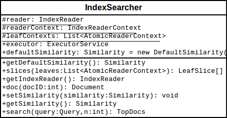

# Index Searcher
`IndexSearcher` implements search over a single `IndexReader`. 

Applications usually need only call the inherited `search(Query, int)` or
`search(Query, Fileter, int)` methods. 

If your index is unchanging, you should share a single `IndexSearcher`
instance across multiple searches instead of creating a new one. 

The UML of the searcher: 

The related classes for searcher are introduced as follow
## `Weight`
`Weight` classes calculate query weights and build query scorers. 
The purpose of `Weight` is to ensure searching does not modify a `Query`,
so that a `Query` instance can be reused. `IndexSeacher` dependent state
of the query should reside in the `Weight`. Dependent state should reside
in the `Scorer`. 

Since `Weight` creates `Scorer` instances for a given
`AtomicReaderContext`, callers must maintain the relationship between the
searcher's top-level `IndexReaderContext` and the context used to create a
`Scorer`

A `Weight` is used in the following way:
1. A `Weight` is constructed by a top-level query, given a
   `IndexSearcher`.
* The `getValueForNormalization()` method is called on the `Weight` to
  compute the query normalization factor `Similarity#queryNorm(float)` of
  the query clauses contained in the query.
* The query normalization factor is passed to `normalize(float, float)`. 

## `Collector`
Collectors are primarily meant to be used to gather raw results from
search, and implement sorting or custom result filtering, collation, etc.
It's used to receive hits in `IndexSearcher`, it's basically a container.

1. `TopDocsCollector` is an abstract base class that assumes you will
   retrieve the top N docs, according to some criteria, after collection
   is done.
* `TopScoreDocCollector` is a concrete subclass `TopDocsCollector` and
  sorts according to score + docID. This is used internally by the
  `IndexSearcher` search methods that do not take an explicit `Sort`.

Collector decouples the score from the collected doc: the score
computation is skipped entirely if it's not needed. 

The doc that is passed to the collect method is relative to the current
reader. If your collector needs to resolve this to the docID space of the
MultiReader, you must re-base it by recording the docBase from the most
recent setNextReader call. 

Simple example:
    IndexSearcher searcher = new IndexSearcher(indexReader);
    final BitSet bits = new BitSet(indexReader.maxDoc());
    searcher.search(query, new Collector() {
        private in docBase;
        // ignore scorer
        public void setScorer(Scorer scorer) { }
        // accept docs out of order
        public boolean acceptsDocsOutOfOrder() {
            return true;
        }
        public void collect(int doc) {
            bits.set(doc + docBase);
        }
        public void setNextReader(AtomicReaderContext context) {
            this.docBase = context.docBase;
        }
    })

`IndexSearcher` use `TopScoreDocCollector`. It collects the top-scoring
hits, returning them as a `TopDocs`. This is used by `IndexSearcher` to
implement `TopDocs`-based search. Hits are sorted by score descending. 

The `collect(int doc)` of `TopScoreDocCollector` basically get the score
of current document and add it to the priority queue.

## Scorers
In `IndexSearcherer`, the low level search API:

    protected void search(List<AtomicReaderContext> leaves, Weight weight, Collector collector)
      throws IOException 

The `Scorer` is get by calling `weight.scorer()`, and the
`scorer.score(Collector)` will collect and score the matched
documents.This will call the `nextDoc()` method. 

The `nextDoc()` implemented in `TermScorer()` is by maintaining a
`DocsEnum`, this is created in `TermQuery` with the following:

    final TermsEnum termsEnum = context.reader().terms(term.field()).iterator(null);
