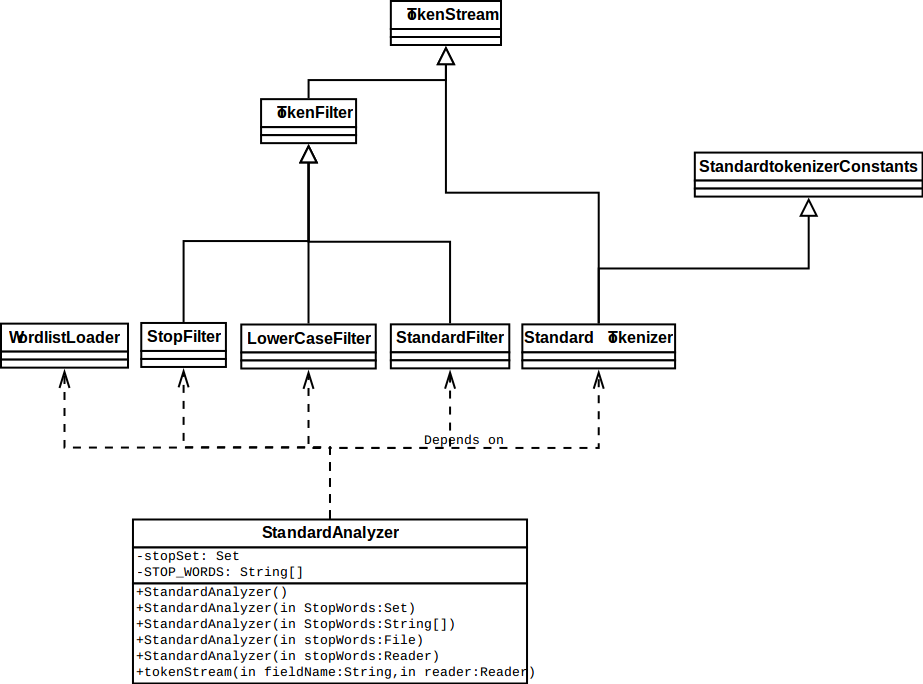

# The Lucene Analyzer

The analyzer is for analyzing the document structure and extract the
document content.

## The `Analyzer` class

The class is in `org.apache.lucene.analysis.Analyzer`, it represents a
policy for extracting index terms from text.

In order to define what analysis is done, subclasses must define their
`TokenStreamComponents` (class) in `createComponts(String, Reader)`.

### Parsing
It is the responsibility of the application to convert the original format
into plain text before passing that plain text to lucene.

### Tokenization
Plain text go through tokenization. 

It breaking input text into small indexing elements -- tokens.

Lucene includes includes both pre- and post-tokenization facilities:

* Stemming`
* Stop Words filtering
* Text Normalization
* Synonym Expansion

### Core Analysis

The analysis package provides the mechanism to convert String and Readers
into tokens that can be indexed by Lucene.

* `Analyzer` -- buiding `TokenStream` which can be consumed by indexing
  and searching.
* `CharFilter` -- extends `Reader` to perform pre-tokenization
  substitutions, deletions, and insertion on a input Reader's text.
* `Tokenizer` -- A `Tokenizer` is a `TokenStream` and is responsible for
  breaking up incoming text into tokens. 
  In most cases, an Analyzer will use a Tokenizer as the first step in
  analysis process. 
* `TokenFilter` -- A `TokenFilter` is also a `TokenStream` and is
  responsible for modifying tokens that have been created by the
  `Tokenizer`. Commonly deletion, stemming, synonym injection, down
  casing. Not all analyzer require `TokenFilter`

Clarification:

* `Analyzer` is responsible for the entire task of **creating** tokens out
  of the input text.
* `Tokenizer` is only responsible for **breaking** the text into token.
* Tokens created by `Tokenizer` would be modified or omitted by the
  `Analyzer` (via `TokenFilter`s)
* `Tokenizer` is a `TokenStream` but `Analyzer` is not

The UML is shown as follow for `StandardAnalyzer` as an example:



Note that a standard analyzer use the `StandardTokenizer` to tokenize the
text, and use `StandardFilter`, `LowerCaseFilter` and `StopFilter` to
filter tokens

Note: The `TokenStreamComponents` encapsulates the outer component of a
token stream. It provides access to the source(`Tokenizer`) and the outer
end (sink), an instance of `TokenFilter` which also serves as the
`TokenStream` returned by `Analyzer.tokenStream(String, Reader)`

### Invoking the Analyzer

* At indexing, as a consequence of `addDocument(doc)`, the Analyzer is in
  effect for indexing is invoked for each indexed field of the added
  document.
* At search, a `QueryParser` may invoke the Analyzer during parsing.

Application might invoke it like:

```java
Version matchVersion = Version.LUCENE_XY; // Substitute desired Lucene version for XY
Analyzer analyzer = new StandardAnalyzer(matchVersion); // or any other analyzer
TokenStream ts = analyzer.tokenStream("myfield", new StringReader("some text goes here"));
OffsetAttribute offsetAtt = addAttribute(OffsetAttribute.class);

try {
  ts.reset(); // Resets this stream to the beginning. (Required)
  while (ts.incrementToken()) {
    // Use AttributeSource.reflectAsString(boolean)
    // for token stream debugging.
    System.out.println("token: " + ts.reflectAsString(true));

    System.out.println("token start offset: " + offsetAtt.startOffset());
    System.out.println("  token end offset: " + offsetAtt.endOffset());
  }
  ts.end();   // Perform end-of-stream operations, e.g. set the final offset.
} finally {
  ts.close(); // Release resources associated with this stream.
}
```

### Implementing Analyzer
`Analyzer` can wrap existing analysis components --
`CharFilter` (optional), a `Tokenizer`, and `TokenFilter` (optional).

Example: whitespace tokenization:

```java
public class MyAnalyzer extends Analyzer {

  private Version matchVersion;
  
  public MyAnalyzer(Version matchVersion) {
    this.matchVersion = matchVersion;
  }

  @Override
  protected TokenStreamComponents createComponents(String fieldName, Reader reader) {
    return new TokenStreamComponents(new WhitespaceTokenizer(matchVersion, reader));
  }
  
  public static void main(String[] args) throws IOException {
    // text to tokenize
    final String text = "This is a demo of the TokenStream API";
    
    Version matchVersion = Version.LUCENE_XY; // Substitute desired Lucene version for XY
    MyAnalyzer analyzer = new MyAnalyzer(matchVersion);
    TokenStream stream = analyzer.tokenStream("field", new StringReader(text));
    
    // get the CharTermAttribute from the TokenStream
    CharTermAttribute termAtt = stream.addAttribute(CharTermAttribute.class);

    try {
      stream.reset();
    
      // print all tokens until stream is exhausted
      while (stream.incrementToken()) {
        System.out.println(termAtt.toString());
      }
    
      stream.end();
    } finally {
      stream.close();
    }
  }
}
```

Add a `LengthFilter`

```java
@Override
protected TokenStreamComponents createComponents(String fieldName, Reader reader) {
    final Tokenizer source = new WhitespaceTokenizer(matchVersion, reader);
    TokenStream result = new LengthFilter(true, source, 3, Integer.MAX_VALUE);
    return new TokenStreamComponents(source, result);
}
```

```java
public final class LengthFilter extends FilteringTokenFilter {

  private final int min;
  private final int max;
  
  private final CharTermAttribute termAtt = addAttribute(CharTermAttribute.class);

  /**
   * Build a filter that removes words that are too long or too
   * short from the text.
   */
  public LengthFilter(boolean enablePositionIncrements, TokenStream in, int min, int max) {
    super(enablePositionIncrements, in);
    this.min = min;
    this.max = max;
  }
  
  @Override
  public boolean accept() throws IOException {
    final int len = termAtt.length();
    return (len >= min && len <= max);
  }
}
```

In `LengthFilter`, the `CharTermAttribute` is added and stored in the
instance variable `termAtt`.

The implementation of `FilteringTokenFilter`

```java
public abstract class FilteringTokenFilter extends TokenFilter {

    private final PositionIncrementAttribute posIncrAtt = addAttribute(PositionIncrementAttribute.class);
    private boolean enablePositionIncrements; // no init needed, as ctor enforces setting value!

    public FilteringTokenFilter(boolean enablePositionIncrements, TokenStream input){
        super(input);
        this.enablePositionIncrements = enablePositionIncrements;
    }

    /** Override this method and return if the current input token should be returned by {@link #incrementToken}. */
    protected abstract boolean accept() throws IOException;

    @Override
    public final boolean incrementToken() throws IOException {
        if (enablePositionIncrements) {
            int skippedPositions = 0;
            while (input.incrementToken()) {
                if (accept()) {
                    if (skippedPositions != 0) {
                        posIncrAtt.setPositionIncrement(posIncrAtt.getPositionIncrement() + skippedPositions);
                    }
                    return true;
                }
                skippedPositions += posIncrAtt.getPositionIncrement();
            }
        } else {
            while (input.incrementToken()) {
                if (accept()) {
                    return true;
                }
            }
        }
        // reached EOS -- return false
        return false;
    }

    /**
     * @see #setEnablePositionIncrements(boolean)
     */
    public boolean getEnablePositionIncrements() {
        return enablePositionIncrements;
    }

    /**
     * If true, this TokenFilter will preserve
     * positions of the incoming tokens (ie, accumulate and
     * set position increments of the removed tokens).
     * Generally, true is best as it does not
     * lose information (positions of the original tokens)
     * during indexing.
     * 
     * 
 When set, when a token is stopped
     * (omitted), the position increment of the following
     * token is incremented.
     *
     * 
 NOTE: be sure to also
     * set org.apache.lucene.queryparser.classic.QueryParser#setEnablePositionIncrements if
     * you use QueryParser to create queries.
     */
    public void setEnablePositionIncrements(boolean enable) {
        this.enablePositionIncrements = enable;
    }
}
```

### Creating Customized Attribute

```java
public interface PartOfSpeechAttribute extends Attribute {
    public static enum PartOfSpeech {
        Noun, Verb, Adjective, Adverb, Pronoun, Preposition, Conjunction, Article, Unknown
    }

    public void setPartOfSpeech(PartOfSpeech pos);

    public PartOfSpeech getPartOfSpeech();
}
```

```java
public final class PartOfSpeechAttributeImpl extends AttributeImpl 
                                  implements PartOfSpeechAttribute {
  
  private PartOfSpeech pos = PartOfSpeech.Unknown;
  
  public void setPartOfSpeech(PartOfSpeech pos) {
    this.pos = pos;
  }
  
  public PartOfSpeech getPartOfSpeech() {
    return pos;
  }

  @Override
  public void clear() {
    pos = PartOfSpeech.Unknown;
  }

  @Override
  public void copyTo(AttributeImpl target) {
    ((PartOfSpeechAttribute) target).setPartOfSpeech(pos);
  }
}
```

```java
public static class PartOfSpeechTaggingFilter extends TokenFilter {
  PartOfSpeechAttribute posAtt = addAttribute(PartOfSpeechAttribute.class);
  CharTermAttribute termAtt = addAttribute(CharTermAttribute.class);
  
  protected PartOfSpeechTaggingFilter(TokenStream input) {
    super(input);
  }
  
  public boolean incrementToken() throws IOException {
    if (!input.incrementToken()) {return false;}
    posAtt.setPartOfSpeech(determinePOS(termAtt.buffer(), 0, termAtt.length()));
    return true;
  }
  
  // determine the part of speech for the given term
  protected PartOfSpeech determinePOS(char[] term, int offset, int length) {
    // naive implementation that tags every uppercased word as noun
    if (length > 0 && Character.isUpperCase(term[0])) {
      return PartOfSpeech.Noun;
    }
    return PartOfSpeech.Unknown;
  }
}
```

```java
@Override
protected TokenStreamComponents createComponents(String fieldName, Reader reader) {
    final Tokenizer source = new WhitespaceTokenizer(matchVersion, reader);
    TokenStream result = new LengthFilter(source, 3, Integer.MAX_VALUE);
    result = new PartOfSpeechTaggingFilter(result);
    return new TokenStreamComponents(source, result);
}
```

```java
public static void main(String[] args) throws IOException {
  // text to tokenize
  final String text = "This is a demo of the TokenStream API";
  
  MyAnalyzer analyzer = new MyAnalyzer();
  TokenStream stream = analyzer.tokenStream("field", new StringReader(text));
  
  // get the CharTermAttribute from the TokenStream
  CharTermAttribute termAtt = stream.addAttribute(CharTermAttribute.class);
  
  // get the PartOfSpeechAttribute from the TokenStream
  PartOfSpeechAttribute posAtt = stream.addAttribute(PartOfSpeechAttribute.class);

  try {
    stream.reset();

    // print all tokens until stream is exhausted
    while (stream.incrementToken()) {
      System.out.println(termAtt.toString() + ": " + posAtt.getPartOfSpeech());
    }
  
    stream.end();
  } finally {
    stream.close();
  }
}
```
```java
public class FirstTokenOfSentenceAttributeImpl extends AttributeImpl
                          implements FirstTokenOfSentenceAttribute {

private boolean firstToken;

public void setFirstToken(boolean firstToken) {
  this.firstToken = firstToken;
}

public boolean getFirstToken() {
  return firstToken;
}

@Override
public void clear() {
  firstToken = false;
}
```

### Adding a CharFilter Chain
```java
public class MyAnalyzer extends Analyzer {

  @Override
  protected TokenStreamComponents createComponents(String fieldName, Reader reader) {
    return new TokenStreamComponents(new MyTokenizer(reader));
  }
  
  @Override
  protected Reader initReader(String fieldName, Reader reader) {
    // wrap the Reader in a CharFilter chain.
    return new SecondCharFilter(new FirstCharFilter(reader));
  }
}
```
