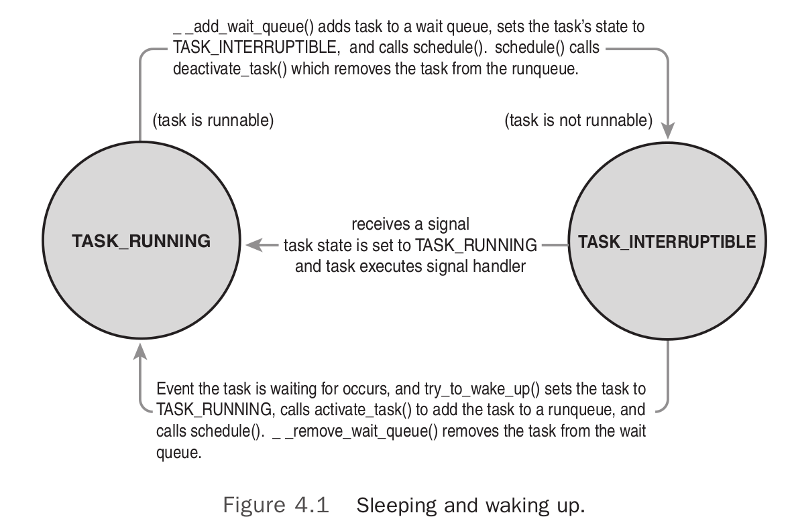

# Process Scheduling
Multitasking operating system: one that can simultaneously interleave
execution of more than one process

Two flavors:

* Cooperative multitasking
* Preemptive multitasking (modern os)

**Preemption**: involuntarily suspending a running process.
**Yielding**: The act of a process voluntarily suspending itself.

## Policy
Policy is the behavior of the scheduler that determines what runs when. 

Tow kinds of processes:

* I/O-bounded: most GUI applications are I/O-bounded (wait on user
  interaction). Only runs for short durations.
* Processor-bound: tends to run less frequently but for longer duration. 

Goal: fast process response time (low latency) and maximal system
utilization (high throughput).

### Process Priority
A common type of scheduling algorithm is priority-based scheduling. The
goal is to rank processes based on their worth and need for processor
time.

The Linux Kernel implements two separate priority ranges:
* *nice value*, from -20 to +19, with a default of 0. Larger nice values
  correspond to lower priority -- you are being nice to other processes on
  the system. In Linux, nice value is a control over the *proportion* of
  timeslices.
* *real-time priority*. Default range from 0 to 99, inclusive. All
  real-time processes are at a higher priority than normal process. That
  is, the real-time priority and nice value are in disjoint value sapces. 

### Timeslice
The timeslice is the numerical value that represents how long a task can
run until it is preempted.

Linux's CFS (Completely Fair Scheduler) does not directly assign temeslice
to processes. Instead, CFS assigns processes a *proportion* of the
processor. On Linux, therefore, the amount of processor time that a
process receives is a function of the load of the system. 

The nice value acts as a weight, changing the proportion of the processor
time each process receives. 

### The Scheduling Policy in Action
Consider a system with two running tasks: a text editor (I/O bounded) and a video
encoder (processor bounded).

Ideally: scheduler gives the text editor a larger proportion of the
available processor than the video encoder, because the text editor is
interactive. 

Two goals for the text editor:

1. We want it to have a large amount of processor time available to it. We
   want it to always have processor time available the moment it needs it.
* We want the text editor to preempt the video encoder the moment it wakes
  up.

On most OS, these goals are accomplished by giving the text a higher
priority and larger timeslice than the video encoder. 

Linux achieves these goals by different means. Instead of assigning the
text editor a specific priority and timelice, it guaranttes the text
editor a specific proportion of the processor.

Say, both the processes has proportion of 50%. When the editor wake up,
CFS notes that it is allotted 50% of the processor but has used
considerably less. Specifically, CFS determines that the text editor has
run for less time than the video encoder (because most of the time, the
editor is waiting and encoder is running). Attempting to give all processes
a fair share of the processor, it then preempts the video encoder and
enables the text editor to run. The text editor runs, quickly processes
the user's key press, and again sleeps, waiting for more input.

Continue this manner, CFS always enabling the text to run when it wants
and the video encoder to run the rest of the time.

## The Linux Scheduling Algorithm
### Scheduler Classes
The Linux Scheduler is modular, enabling different algorithms to schedule
different types of processes. This modularity is called *schedular
classes*. Scheduler classes enable different, pluggable algorithms to
coexist, scheduling their own types of processes.

The base scheduler code, which defined in `kerenel/sched.c`, iterates over
each scheduler class in order of priority. The highest priority scheduler
class that has a runnable process wins, selecting who runs next.

The Completely Fair Scheduler(CFS) is the registered scheduler class for
normal processes, called `SCHED_NORMAL` in Linux. CFS is defined in
`kernel/sched_fair.c`

### Process Scheduling in Unix Systems
Process with a higher priority run more frequently and receive higher
timeslice. Problems:

1. Mapping nice values onto timeslice requires a decision about what
   absolute timeslice to allot each nice value. e.g. nice value with
   timeslice of 100 ms and +20 nice vlaue with 5ms. If we run exactly two
   low priority processes, each enjoy the processor of 5 ms at a time. If
   we have two normal priority processes, each again receives 50% of the
   processor, in 100 ms increments. Both of them are *backward* from ideal.
* Relative nice values and again the nice value to timeslice mapping.
  "nicing down a process by one" has wildly different effects depending on
  the starting nice value. 
* If performing a nice value to timeslice mapping, we need the ability to
  assign absolute timeslice. This absolute value must be measured in terms
  the kernel can measure. 
* Handling process wake up in a priority-based scheduler that wants to
  optimize for interactive tasks. 

### Fair Scheduling
CFS uses the nice value to *weight* the proportion of processor a process
is to revieve. 

Each process then runs for a "timeslice" proportional to tis weight
divided by the toal weight of all runnable threads. 

* **target latency**: the target for CFS's approximation of the scheduling
  duration. Smaller targets yields yield better interactivity and a closer
  approximation to perfect multitasking, at the expense of hier switch
  costs and worse throughput. 
* **minimum granularity** a floor on the timeslice assigned to each
  process.

## The Linux Scheduling Implementation
CFS's acutal implementation lives in `kernel/sched_fair.c`. Components of
CFS:

* Time Accounting 
* Process Selection
* The Scheduler Entry Point
* Sleeping and Waking Up

### Time Accounting
Most Unix systems do so, by assigning each process a timeslice. On each
tick of the system clock, the timeslice is decremented by the tick period.

When the timeslice reaches zero, the process is preempted in favor of
another runnable process with a non zero timeslice.

#### The scheduler Entity Structure
CFS uses the *scheduler entity structure*, `struct sched_entity`, defined
in `<linux/sched.h>`, to keep track of process accounting:
    
    struct sched_entity {
        struct load_weight load;
        struct rb_node run_node;
        struct list_head group_node;
        unsigned int on_rq;
        u64 exec_start;
        u64 sum_exec_runtime;
        u64 vruntime;
        u64 prev_sum_exec_runtime;
        u64 last_wakeup;
        u64 avg_overlap;
        u64 nr_migrations;
        u64 start runtime;
        u64 avg_wakeup;
    };

The scheduler entity structure is embedded in the *process-descriptor*,
`struct task_struct`, as a member variable named `se`.

#### The Virtual Runtime
The `vruntime` variable stores the *virtual runtime* of a process, which
is the actual runtime normalized by the number of runnable process.

The virtual runtime's unit is nanoseconds and therefore `vruntime` is
decoupled from the timer tick.

CFS uses `vruntime` to account for how long a process has run and thus how
much longer it ought to run. 

The function `update_curr()`, defined in `kernel/sched_fair.c` manages
this accounting. It will calculates the execution time of the current
process and stores that value in `delta_exec`. It then passes that runtime
to `__update_curr()`, which weights the time by the number of runnable
processes. 

`update_curr()` is invoked periodically by the system timer and also
whenever a process becomes runnable or blocks, becoming unrunnable. 

### Process Selection

Simple rule: When CFS is deciding what process to run next, it picks the
process with the smallest `vruntime`. 

CFS uses a *red-black* to manage the list of **runnable processes** and
efficiently find the process with the smallest `vruntime`. 

It involves:

1. **Picking the Next Task**: Given the rbtree, the process that CFS wants to
   run next, which is the process with the smallest `vruntime`, is the
   leftmost node in the tree. The function perform this selection is
   `__pick_next_entity()` defined in `kernel/sched_fair.c`. With the
   line`struct rb_node *left = cfs_rq->rb_leftmost;` ( it does not really
   traverse the tree)
* **Adding processes to the Tree** and caches the leftmost node. This would
  occur when a process becomes runnable(wakes up) or its first created via
  `fork()`. Adding process is performed by `enqueue_entity()`. This
  function updates the runtime and other statistics and then invokes
  `__enqueue_entity()` to perform the actual heavy lifting of inserting
  the entry to rbtree.
* **Removing Process from the tree**. This happens when a process blocks or
  terminates. With `dequeue_entity()`, and then, the real work is
  performed by the helper function `__dequeue_entity()`.

### The Scheduler Entry Point
The main entry point into the process schedule is the function `shedule()`
is the function `schedule()`, defined in `kernel/sched.c`. This is the
function that the rest of the kernel uses to invoke the process scheduler,
deciding which process to run and then running it. 

It finds the highest priority scheduler class with a runnable process and
asks it what to run next.

The only important part of the function, `pick_next_taks()` also defined
in `kernel/sched.c`..The `pick_next_task()` function goes through each
scheduler class, starting with the highest priority, and selects the
highest process in the highest priority class.

    /*
     * Pick up the highest-prio task:
     */
    static inline struct task_struct *
    pick_next_task(struct rq *rq)
    {
        const struct sched_class *class;
        struct task_struct *p;
        /*
        * Optimization: we know that if all tasks are in
        * the fair class we can call that function directly:
        */
        if (likely(rq->nr_running == rq->cfs.nr_running)) {
            p = fair_sched_class.pick_next_task(rq);
            if (likely(p))
                return p;
        }
        class = sched_class_highest;
        for ( ; ; ) {
            p = class->pick_next_task(rq);
            if (p)
            return p;
            /*
            * Will never be NULL as the idle class always
            * returns a non-NULL p:
            */
            class = class->next;
        }
    }

The optimization at the beginning of the function. Because CFS is the
scheduler class for normal processes, and most systems run mostly normal
processes, there is a small hack to quick select the next CFS-provided
process if the number of runnable processes is equal to the number of CFS
runnable process. (all processes are provided by CFS)

The core of the function is the `for()` loop, which iterates over each
class in priority order, starting with the highest priority. Each class
implements the `pick_next_task()` function.

CFS's implementation of `pick_next_task()` calls `pick_next_entity()`,
which in tern calls the `__pick_next_entity()`.

### Sleeping and Waking Up
Tasks that are sleeping (blocked) are in a special nonrunnable state. A
tasks sleeps while it is waiting for some event. Behavior:

1. The Task marks itself as sleeping
* Puts itself on a waiting queue.
* Removes itself from the red-black tree of runnable
* Calls `schedule()` to select a new process to execute.

Waking back up is inverse:

1. The task is set as runnable
* Removed from the wait queue
* added back to red-black tree. 

Two states are associated with sleeping:

* `TASK_INTERRUPTIBLE`: wake up prematurely and respond to signal if one
  is issued
* `TASK_UNITERRUPTIBLE`: Ignore signals

Both types sit on a wait queue, waiting for an event to occur, and are not
runnable.

#### Wait Queues
A wait queue is a simple list of processes waiting for an event to occur.
Wait queues are represented in the kernel by `wake_queue_head_t`.

It is created statically via `DECLARE_WAITQUEUE()` or dynamically via
`init_waitqueue_head()`. Processes put themselves on a waitqueue and amrk
themselves not runnable.

    DEFINE_WAIT(wait)
    add_wait_queue(q, &wait);
    while(!condition) { /* condition is the event that we are waiting for*/
        prepare_to_wait(&q, &wait, TASK_INTERRUPTIBLE);
        if(signal_pending(current))
            /*handle signal */
        schedule();
    }
    finish_wait(&q, &wait);

Tasks performs the following steps to a wait queue:

1. Create a wait queue entry with `DEFINE_WAIT()`
* Add to wait queue via `add_wait_queue()`. There needs to be code else
  where that call `wake_up()` on the queue when the event actually does
  occur.
* Calls `prepare_to_wait()` to change to `TASK_INTERRUPTIBLE` or
  `TASK_UNINTERRUPTIBLE`. 
* If the state is set to `TASK_INTERRUPTIBLE` , a signal wakes the process
  up.This is called a *spurious wake up* (a wake-up not caused by the
  occurrence of the event). So check and handle signals.
* When the task awakens, it again checks whether the condition is true, if
  it is, it exits loop. Otherwise, it again calls `schedule()` and repeats
* Now the condition is true, the task sets itself to `TASK_RUNNABLE` and
  removes itself from the wait queue via `finish_wait()`.

Note that kernel code often has to perform various other tasks in the body
of the loop. For example, it might need to release locks before calling
`schedule()`

The function `inotify_read()` in `fs/notify/inotify/inotify_user.c` which
handles reading from the inotify file descriptor, is straightforward
example of using wait queues:

#### Waking UP
Waking is handled via `wake_up()`, which wakes up all the tasks waiting on
the given wait queue. It calls `try_to_wake_up()`, which sets the task's
state to `TASK_RUNNING`, calls `enqueue_task()` to add the task to the
red-black tree, and sets `need_resched` if the awakened task's priority is
higher than the priority of the current task.

The code that causes the event to occur typically calls `wake_up()`
itself. For example, when data arrives from the had disk, the VFS calls
`wake_up()` on the wait queue that holds the processes waiting for the
data. (Each event corresponding to a separate wait queue, for example, the
`inotify_read` calls `prepare_to_wait(&group->notification_waitq, &wait,
TASK_INTERRUPTIBLE)`

An important note: there are spurious wake-ups. Just because a task is
awakened does not mean that the event for which the task is waiting has
occurred; sleep should always be handled in a loop that ensures that the
condition for which the task is waiting has indeed occurred.  As shown in
the following figure.

## Preemption and Context Switching
Context switching, the switching from one runnable task to another, is
handled by `context_switch()` in `kernel/sched.c`. It is called by
`schedule()` when a new process has been selected to run.

Tow basic jobs:

* Calls `switch_mm()`, in `<asm/mmu_context.h>`, to switch the virtual
  memory mapping from previous to new process.
* Calls `switch_to()` in `<asm/system.h>` to switch the state from
  previous to current. This involves saving and restoring stack
  information and the processor registers.

The kernel must know when to call `schedule()`. If it called `schedule()`
only when code explicitly did so, user-space programs could run
indefinitely. 

The kernel provides the  `need_resched` flag to signify whether a
reschedule should be performed. 

* This flag is set by `scheduler_tick()` when a process should be preempted, and
* by `try_to_wake_up()` when a process that has a higher priority than the
  currently running process is awakened.

The kernel checks the flag, sees that it is set, and calls
`schedule()` to switch to a new process.The flag is a message to the
kernel that the scheduler should be invoked as soon as possible because
another process deserves to run.

Upon returning to user-space or returning from an interrupt, the
`need_resched` flag is checked. If it is set, the kernel invokes the
scheduler before continuing. The flag is per-process and not simply
global.

If a process enters the `TASK_RUNNING` state, the kernel checks whether
tis dynamic priority is greater than the priority of the currently running
process. If it is, the execution of current is interrupted and the
scheduler is invoked to select another process to run.

For instance, let us consider a scenario in which only two programs--a
text editor and a compiler--are being executed. 

1. The text editor is an interactive program, therefore it has a higher
   dynamic priority than the compiler. Nevertheless, it is often
   suspended, since the user alternates between pauses for think time and
   data entry; moreover, the average delay between two key-presses is
   relatively long. 
* However, as soon as the user presses a key, an interrupt is raised, and
  the kernel wakes up the text editor process. 
* The kernel also determines that the dynamic priority of the editor is
  higher than the priority of current, the currently running process (that
  is, the compiler), and hence it sets the `need_resched` field of this
  process, thus forcing the scheduler to be activated when the kernel
  finishes handling the interrupt.
* The scheduler selects the editor and performs a task switch; as a
  result, the execution of the editor is resumed very quickly and the
  character typed by the user is echoed to the screen. 
* When the character has been processed, the text editor process suspends
  itself waiting for another keypress, and the compiler process can resume
  its execution.

#### User Preemption
User preemption can occur:

* When returning to user-space from system call
* When returning to user-space from an interrupt handler.

At these two moments, `need_resched` is checked, if it is set, the
scheduler is invoked.

#### Kernel Preemption
* Nonpreemptive kernel: kernel code runs until completion.
* Preemptive kernel(linux): kernel become preemptive.

When safe to reschedule? -- the kernel can preempt a task running in the
kernel so long as it does not hold a lock.

Because the kernel is SMP-safe, if a lock is not held, the current code is 
reentrant and capable of being preempted.

Supporting Kernel Preemption:

* `preempt_count` to each process's `thread_info`. Begins at zero and
  increments once for each lock that is acquired and decrements once for
  each lock that is released.

## Real-Time Scheduling Policies
Linux provides two real-time scheduling policies, `SCHED_FIFO` and
`SCHED_RR`. The normal, not real-time scheduling policy is `SCHED_NORMAL`.
These real-time policies are managed not by the CFS, but by the special
realtime scheduler in `kernel/sched_rt.c`

`SCHED_FIFO`, first in first out without timeslices. A runnable
`SCHED_FIFO` task is always scheduled over any `SCHED_NORMAL` taks. Only a
higher priority `SCHED_FIFO` or `SCHED_RR` task can preempt a
`SCHED_FIFO`.

`SCHED_RR` is identical to `SCHED_FIFO` except that each process can run
oly until it exhausts a predetermined timeslice.

Both real-time policies provide implement static priorities. The kernel
does not calculate dynamic priority values for real-time tasks.

The real-time policies in Linux provide Soft real time behavior: kernel tries to schedule applications within timing
deadlines, but the kernel does not promise to always achieve these goals.

Hard real time: guaranteed to meet any scheduling requirements within
certain limits.

