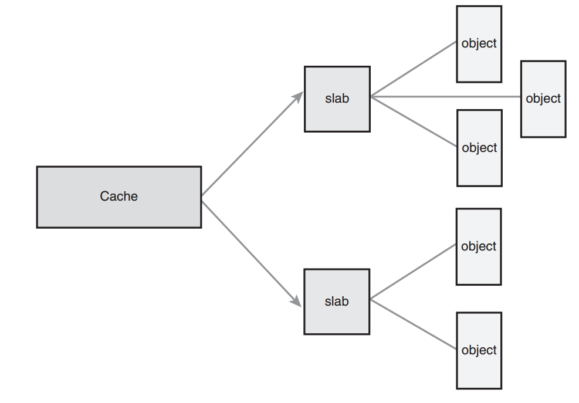

# Memory Management
## Pages
The kernel treats physical pages as the basic unit of memory management.
MMU typically deals in pages. MMU maintains the system's page tables with
page-sized granularity.

The kernel represents *every* physical page on the system with a `struct
page` structure, defined in `<linux/mm_types.h>`. A simplified version of
definition:

    struct page {
        unsigned long flags;
        atomic_t _count; 
        atomic_t _mapcount; 
        unsigned long private; 
        struct address_space *mapping; 
        pgoff_t index; 
        struct list_head lru; 
        void *virtual;
    };

* `flags` status of the page, whether the page is dirty or whether it is
  locked in memory. Flags are defined in `<linux/page-flags.h>`.
* `_count` stores the usage count of the page -- how may references there
  are to this page. When this count reaches negative one, no one is using
  the page and it becomes ready for use in a new allocation. Kernel code
  should use the function `page_count()` to check this field, which take a
  `page` structure as its solo parameter.
* The `virtual` field is the page's virtual address.

The important point is that `page` structure is associated with physical
pages, not virtual pages. 

The kernel uses this structure to keep track of all the pages in the
system, because the kernel needs to know whether a page is free. If a page
is not free, the kernel needs to know who owns the page. Possible owners
include user-space processes, dynamically allocated kernel data, static
kernel code, the page cache, and so on.

An instance of this structure is allocated for each physical page in the
system.

## Zones
Some pages, because of their physical address in memory, cannot be used
for certain tasks, so the kernel divides pages into different *zones*.
Linux partitions the system's pages into zones to have a pooling in place
to satisfy allocations as needed. 

Zones are defined in `<linux/mmzone.h>`, four primary memory zones:

* `ZONE_DMA` -- pages that can undergo DMA
* `ZONE_DMA32` -- accessible only by 32-bit devs
* `ZONE_NORMAL`-- normal, regularly mapped pages
* `ZONE_HIGHMEM` -- "high-memory", pages not permanently mapped into
  kernel's address space.

Linux partitions the system’s pages into zones to have a pooling in place
to satisfy allocations as needed.

Each zone is represented by `struct zone`

```c
struct zone { 
    unsigned long watermark[NR_WMARK]; 
    unsigned long lowmem_reserve[MAX_NR_ZONES]; 
    struct per_cpu_pageset pageset[NR_CPUS]; 
    spinlock_t lock;
    struct free_area free_area[MAX_ORDER] 
    spinlock_t lru_lock; 
    struct zone_lru {
    struct list_head list; 
    unsigned long nr_saved_scan;
    } lru[NR_LRU_LISTS]; 
    struct zone_reclaim_stat reclaim_stat; 
    unsigned long pages_scanned; 
    unsigned long flags; 
    atomic_long_t vm_stat[NR_VM_ZONE_STAT_ITEMS]; 
    int prev_priority; 
    unsigned int inactive_ratio; 
    wait_queue_head_t *wait_table; 
    unsigned long wait_table_hash_nr_entries; 
    unsigned long wait_table_bits; 
    struct pglist_data *zone_pgdat; 
    unsigned long zone_start_pfn; 
    unsigned long spanned_pages; 
    unsigned long present_pages; 
    const char *name;
}; 
```

* `lock` -- a spin lock that protects the structure from concurrent access
* `watermark` -- minimum, low and high watermarks for this zone. 
* `name` -- name of this zone.

## Getting Pages
The kernel provides one low-level mechanism for requesting memory, along
with several interfaces to access it, declared in `<linux/gfp.h>`. The
core function is
```c
struct page * alloc_pages(gfp_t gfp_mask, unsigned int order)
```
This allocates `1 << order` contiguous physical pages and returns a
pointer to the first page's page structure.

Convert a given page to its logical address with the function:
```c
void *page_address(struct page *page)
```

Getting zeroed pages:
```c
unsigned long get_zeroed_page(unsigned int gfp_mask)
```

Freeing page:
```c
void __free_pages(struct page *page, unsigned int order)
void free_pages(unsinged long addr, unsigned int order)
void free_page(unsigned long addr)
```

## kmalloc()
The `kmalloc()` function's operation is similar to that of `malloc()`,
with the exception of the additional `flags` parameter parameter. The
`kmalloc()` function is a simple interface for obtaining kernel memory in
byte-sized chunks.

The function is decared in `<linux/slab.h>`:

```c
void * kmalloc(size_t size, gfp_t flags)
```

The function returns a pointer to a region of memory that is at least
`size` bytes in length. The region of memory allocated is physically
contiguous.

Flags are represented by `gfp_t` type, defined in `<linux/types.h>` as an
`unsigned int`, *gfp* stands for `__get_free_pages()`.

Three categories:
* action modifiers: *how* the kernel is supposed to allocate the requested
  memory. In certain situations, only certain methods can be employed to
  allocate memory. For example, interrupt handlers must isntruct the
  kernel not to sleep.
* zone modifiers: specify from which of the zones to allocate memory.
* Type: specify a combination of action and zone modifiers as needed by a
  certain *type* of memory allocation.

## kfree()

The counterpart to `kmalloc()` is `kfree()`, which is declared in
`<linux/slab.h>`
```c
void kfree(const void* ptr)
```

## vmalloc()
The `vmalloc()` function works in a similar fashion to `kmalloc()`, except
it allocates memory that is only virtually contiguous and not necessarily
physically contiguous. 

This is how a user-space allocation function works: The pages returned by
`malloc()` are contiguous within the virtual address space of the
processor, but there is no guarantee that they are actually contiguous in
physical RAM.

The `kmalloc()` function guarantees that the pages are physically
contiguous. The `vmalloc()` function ensures only that the pages are
contiguous within the virtual address space.

It does this by allocating potentially noncontiguous chunks of physical
memory and "fixing up" the page tables to map the memory into a contiguous
chunk of the logical address space.

For most part, only hardware devices require physically contiguous memory
allocations.

Most kernel code use `kmalloc()` for performance.

The `vmalloc()` function is declared in `<linux/vmalloc.h>` and defined in
`mm/vmalloc.c`

## Slab Layer.
Free list: contains a block of available, already allocated, data
structures.

When code requires a new instance of a data structure, it can grab one of
the structures off the free list rather than allocate the sufficient
amount of memory and set it up for the data structure. Later, when the
data structure is no longer needed, it is returned to the free list
instead of deallocated. 

The free list is acts as an object cache, caching a frequently used *type*
of object.

The slab layer (slab allocator) acts as a generic data structure-caching
layer.

Leverage several basic tenets:
* Frequently used data structure tend to be allocated and freed often, so
  cache them.
* To prevent fragmentation, the cached free lists are arranged
  contiguously.
* The free list provides improved performance during frequent allocation
  and deallocation.

### Design of the Slab Layer

* The slab layer divides different objects into groups called *caches*,
  each of which stores a different type of object. (e.g.\ one cache is for
  process descriptors, whereas another cache is for inode objects.
* The caches are then divided into *slabs*. The slabs are composed of one
  or more physically contiguous pages. Typically one.
* Each slab contains some number of *objects*, which are the data
  structures being cached. Each slab is in one of the three states:
  - Full: has no free objects
  - Empty: no allocated objects
  - Partial: some allocated objects and some free objects. When some part
    of the kernel requests are new object, the request is satisfied from
    a partial slab, if one exists. Otherwise, the request is satisfied
    from an empty slab. If no empty, one is created. 

The relationship between caches, slabs, and objects:



---

Take `inode` structure as an example:
* `struct inode` is allocated from the `inode_cachep` cache. 
* This cache is made up of one or more slabs
* Each slab contains as many `struct inode` object as possible.
* When the kernel requests a new `inode` structure, the kernel returns a
  pointer to an already allocated, but unused structure from a partial
  slab or empty slab.
* When the kernel is done using the `inode` object, the slab allocator
  marks the objects as free.

Each cache is represented by a `kmem_cache` structure. This structure
contains three lists:

* `slabs_full`
* `slabs_partial`
* `slabs_empty`

Stored inside a `kmem_list3` structure defined in `mm/slab.c`.

---

A slab descriptor:

```c
struct slab { 
    struct list_head list;   /* full, partial, or empty list */
    unsigned long colouroff; /* offset for the slab coloring */
    void *s_mem;             /* first object in the slab */
    unsigned int inuse;      /* allocated objects in the slab */
    kmem_bufctl_t free;      /* first free object, if any */
};
```

Slab descriptors are allocated either outside the slab in a general cache
or inside the slab itself, at the beginning.The slab allocator creates new
slabs by interfacing with the low-levl kernel page allocator:
```c
static void *kmem_getpages(struct kmem_cache *cachep, gfp_t flags, int nodeid) {
    struct page *page; 
    void *addr; 
    int i;
    flags |= cachep->gfpflags; 
    if (likely(nodeid == -1)) {
        addr = (void*)__get_free_pages(flags, cachep->gfporder); 
        if (!addr)
            return NULL; 
        page = virt_to_page(addr);
    } else {
        page = alloc_pages_node(nodeid, flags, cachep->gfporder); 
        if (!page)
            return NULL; 
            addr = page_address(page);
    }
    i = (1 << cachep->gfporder); 
    if (cachep->flags & SLAB_RECLAIM_ACCOUNT)
        atomic_add(i, &slab_reclaim_pages); 
    add_page_state(nr_slab, i); 
    while (i––) {
        SetPageSlab(page); 
        page++;
    } 
    return addr;
}

```
We can ignore the NUMA-aware code and write a simple `kmem_getpages`
```c
static inline void * kmem_getpages(struct kmem_cache *cachep, gfp_t flags) {
    void *addr;
    flags |= cachep->gfpflags; 
    addr = (void*) __get_free_pages(flags, cachep->gfporder);
    return addr; 
}
```

The freeing function is called only when available memory grows low and
the system is attempting to free memory, or when a cache is explicitly
destroyed.

The slab layer is managed on a per-cache basis through a simple interface,
which is exported to the entire kernel. The interface enables the creation
and destruction of new caches and the allocation and freeing of objects
within the caches.The sophisticated management of caches and the slabs
within is entirely handled by the internals of the slab layer.After you
create a cache, the slab layer works just like a specialized allocator for
the specific type of object.

### Slab Allocator Interface
A new cache is created via:
```c
struct kmem_cache * kmem_cache_create(const char *name, 
                size_t size,  // size of each element
                size_t align, //offset of the first object
                unsigned long flags, // cache's behavior
                void (*ctor)(void *)); // constructor, when a new page is added
```

Destroying a cache:
```c
int kmem_cache_destroy(struct kmem_cache *cachep)
```
It is generally invoked from module shutdown code in modules that create
their caches.

---

Allocating from the Cache
```c
void* kmem_cache_alloc(struct kmem_cache *cachep, gfp_t flags)
```

This function returns a pointer to an object from the given cache
`cachep`. If no free objects, the slab layer must obtain new pages via
`kmem_getpages()`. 

To free an object:
```c
void kmem_cache_free(struct kmem_cache *cachep, void *objp)
```

### of Using the Slab
```c
struct kmem_cache *task_struct_cachep;
task_struct_cachep = kmem_cache_create(“task_struct”, 
                            sizeof(struct task_struct), 
                            ARCH_MIN_TASKALIGN, 
                            SLAB_PANIC | SLAB_NOTRACK, 
                            NULL);
struct task_struct *tsk;
// fork()
tsk = kmem_cache_alloc(task_struct_cachep, GFP_KERNEL); 
if (!tsk)
    return NULL;
// After a task dies
kmem_cache_free(task_struct_cachep, tsk)

// It's in fact never destroyed.
int err;
err = kmem_cache_destroy(task_struct_cachep); 
if (err)
    /* error destroying cache */
```
